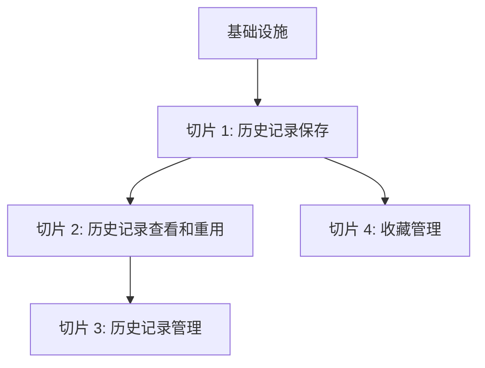
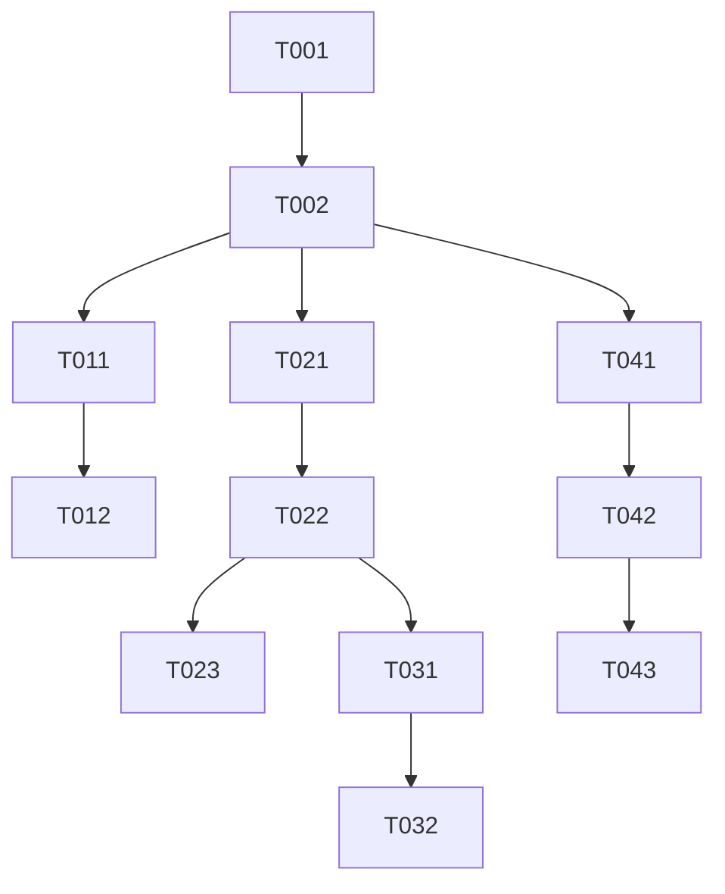

# 任务规划：{{功能名称}}

## 1. 任务概览

### 1.1 总览
- **功能名称**：{{功能名称}}
- **技术方案**：[{{功能名称}}_技术方案.md](file:///Users/aisling308/Desktop/aidevs/DevTools/specs/features/{{功能名称}}_技术方案.md)
- **需求文档**：[{{功能名称}}.md](file:///Users/aisling308/Desktop/aidevs/DevTools/specs/features/{{功能名称}}.md)
- **总任务数**：{{总任务数}}
- **预估总工时**：{{预估总工时}}

### 1.2 切片划分

## 2. 详细任务清单

### 2.1 基础设施

| 任务编号 | 任务名称 | 技术方案章节 | 对应 AC | 通俗解释 | 验证标准 | 依赖任务 | 预估工时 |
|---------|---------|-------------|---------|---------|---------|---------|---------|
| T001 | 扩展数据库操作函数 | 5.1 数据库操作 | AC-012 | 为历史记录和收藏功能添加数据库操作函数 | 1. 数据库操作函数能正常保存、获取、删除历史记录 2. 数据库操作函数能正常保存、获取、删除收藏 | - | 1h |
| T002 | 注册历史记录相关 IPC 处理器 | 5.2 IPC 通信实现 | AC-007 | 为历史记录和收藏功能添加 IPC 通信处理 | 1. IPC 处理器能正确响应历史记录保存请求 2. IPC 处理器能正确响应历史记录获取请求 3. IPC 处理器能正确响应历史记录删除请求 | T001 | 1h |

### 2.2 切片 1: 历史记录保存

| 任务编号 | 任务名称 | 技术方案章节 | 对应 AC | 通俗解释 | 验证标准 | 依赖任务 | 预估工时 |
|---------|---------|-------------|---------|---------|---------|---------|---------|
| T011 | 实现历史记录保存逻辑 | 5.1.1 历史记录操作 | AC-001, AC-002, AC-003, AC-011 | 工具操作后自动保存历史记录 | 1. HTTP 工具操作后历史记录被保存 2. 正则表达式工具操作后历史记录被保存 3. 编码解码工具操作后历史记录被保存 | T002 | 2h |
| T012 | 实现历史记录数量限制 | 5.1.1 历史记录操作 | AC-008 | 当历史记录达到上限时自动删除最旧的记录 | 1. 当历史记录达到 1000 条时，新记录保存后最旧的记录被删除 | T011 | 1h |

### 2.3 切片 2: 历史记录查看和重用

| 任务编号 | 任务名称 | 技术方案章节 | 对应 AC | 通俗解释 | 验证标准 | 依赖任务 | 预估工时 |
|---------|---------|-------------|---------|---------|---------|---------|---------|
| T021 | 创建 historyStore 状态管理 | 5.3 前端状态管理 | AC-004 | 管理历史记录的状态 | 1. historyStore 能正确加载历史记录 2. historyStore 能正确管理历史记录状态 | T002 | 1h |
| T022 | 创建 HistoryList 组件 | 6.1 组件结构 | AC-004, AC-013 | 展示历史记录列表 | 1. 历史记录列表按时间倒序显示 2. 历史记录列表显示工具类型、操作时间、输入/输出摘要 | T021 | 2h |
| T023 | 实现历史记录重用功能 | 6.1 组件结构 | AC-005 | 点击历史记录项加载数据到对应工具 | 1. 点击历史记录项后，对应工具加载历史数据 2. 加载后工具能正常使用历史数据 | T022 | 2h |

### 2.4 切片 3: 历史记录管理

| 任务编号 | 任务名称 | 技术方案章节 | 对应 AC | 通俗解释 | 验证标准 | 依赖任务 | 预估工时 |
|---------|---------|-------------|---------|---------|---------|---------|---------|
| T031 | 实现历史记录删除功能 | 5.1.1 历史记录操作 | AC-006, AC-014 | 删除选中的历史记录 | 1. 选择历史记录后点击删除按钮，记录被删除 2. 清空历史记录功能能删除所有历史记录 | T022 | 1h |
| T032 | 实现异常处理 | 7. 异常处理 | AC-007, AC-009, AC-010 | 处理数据库异常、数据异常和 IPC 通信异常 | 1. 数据库连接失败时显示保存失败提示 2. 加载已删除记录时显示记录不存在提示 3. 数据格式异常时显示数据格式错误提示 | T031 | 1h |

### 2.5 切片 4: 收藏管理

| 任务编号 | 任务名称 | 技术方案章节 | 对应 AC | 通俗解释 | 验证标准 | 依赖任务 | 预估工时 |
|---------|---------|-------------|---------|---------|---------|---------|---------|
| T041 | 实现收藏保存功能 | 5.1 数据库操作 | AC-002 | 保存常用的正则表达式等到收藏 | 1. 能成功保存正则表达式到收藏 2. 能成功保存其他工具的常用配置到收藏 | T002 | 1h |
| T042 | 创建 FavoriteList 组件 | 6.1 组件结构 | AC-002 | 展示收藏列表 | 1. 收藏列表按工具类型显示 2. 收藏列表显示收藏名称和相关信息 | T041 | 2h |
| T043 | 实现收藏删除功能 | 5.1 数据库操作 | AC-002 | 删除收藏 | 1. 点击删除按钮能成功删除收藏 2. 删除后收藏列表更新 | T042 | 1h |

## 3. 执行计划

### 3.1 依赖关系图

### 3.2 关键路径
- **关键任务**：T001 → T002 → T011 → T021 → T022 → T023
- **预计完成时间**：基于 8 小时工作日，预计 2 天完成

### 3.3 并行任务
- T011 和 T021 可以并行执行
- T023 和 T031 可以并行执行
- T032 和 T041 可以并行执行

## 4. 验证计划

| 验证项 | 对应任务 | 对应 AC | 验证方法 |
|--------|---------|---------|----------|
| 历史记录自动保存 | T011 | AC-001, AC-002, AC-003, AC-011 | 1. 使用 HTTP 工具发送请求，检查历史记录是否保存 2. 使用正则表达式工具测试表达式，检查历史记录是否保存 3. 使用编码解码工具执行转换，检查历史记录是否保存 |
| 历史记录数量限制 | T012 | AC-008 | 1. 手动添加 1000 条历史记录 2. 再添加一条新记录，检查最旧的记录是否被删除 |
| 历史记录列表显示 | T022 | AC-004, AC-013 | 1. 打开历史记录列表，检查记录是否按时间倒序显示 2. 检查每条记录是否显示工具类型、操作时间、输入/输出摘要 |
| 历史记录重用 | T023 | AC-005 | 1. 在历史记录列表中选择一条记录 2. 点击加载，检查对应工具是否加载历史数据 3. 使用加载的数据执行操作，检查是否正常 |
| 历史记录删除 | T031 | AC-006, AC-014 | 1. 选择多条历史记录，点击删除 2. 检查记录是否被删除 3. 点击清空按钮，检查所有记录是否被删除 |
| 异常处理 | T032 | AC-007, AC-009, AC-010 | 1. 模拟数据库连接失败，检查是否显示保存失败提示 2. 尝试加载已删除的记录，检查是否显示记录不存在提示 3. 模拟数据格式异常，检查是否显示数据格式错误提示 |
| 收藏功能 | T041, T042, T043 | AC-002 | 1. 保存正则表达式到收藏 2. 打开收藏列表，检查是否显示 3. 点击收藏项加载数据，检查是否正常 4. 删除收藏，检查是否被删除 |
