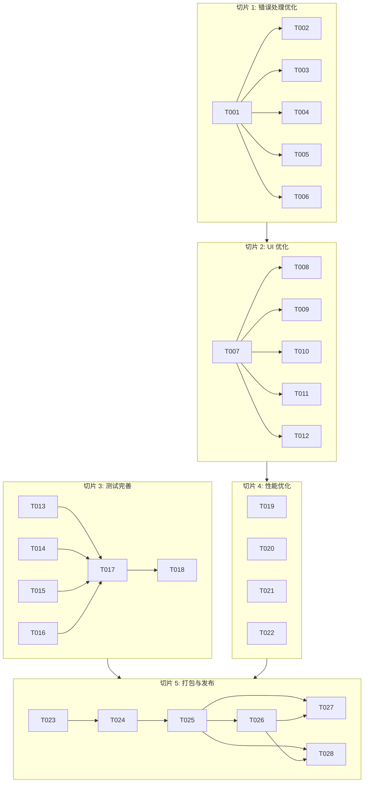

# 功能完善任务规划

## 1. 任务规划概述

**功能模块**: 功能完善 (Feature Complete)
**技术栈**: Electron + React + TypeScript + Tailwind CSS
**开发周期**: 2026-04-19 至 2026-04-25
**任务规划状态**: 📋 规划中

## 2. 垂直切片划分

根据技术方案，将功能完善阶段划分为以下垂直切片：

1. **切片 1: 错误处理优化**
   - 对应技术方案章节：3.1.1 错误处理优化
   - 对应验收标准：AC-005, AC-006, AC-007, AC-008, AC-009

2. **切片 2: UI 优化**
   - 对应技术方案章节：3.1.2 UI 优化
   - 对应验收标准：AC-003, AC-004, AC-012, AC-013

3. **切片 3: 测试完善**
   - 对应技术方案章节：3.1.3 测试完善
   - 对应验收标准：AC-010, AC-011

4. **切片 4: 性能优化**
   - 对应技术方案章节：3.1.4 性能优化
   - 对应验收标准：AC-001, AC-002

5. **切片 5: 打包与发布**
   - 对应技术方案章节：3.2 Phase 2.2: 打包与发布
   - 对应验收标准：AC-014, AC-015, AC-016, AC-017, AC-018, AC-019, AC-020, AC-021

## 3. 详细任务列表

### 3.1 切片 1: 错误处理优化

| 任务编号 | 任务名称 | 通俗解释 | 技术实现 | 验证标准 | 依赖 | 预计时间 |
|---------|---------|---------|----------|---------|------|----------|
| T001 | 创建错误处理组件 | 实现一个统一的错误提示组件，用于显示各类错误信息 | 创建 `src/renderer/components/ErrorMessage.tsx` 组件 | 1. 组件能显示错误消息 2. 组件支持关闭功能 3. 组件样式符合设计规范 | 无 | 0.5 天 |
| T002 | 为编码解码工具添加错误处理 | 在编码解码工具中添加错误状态管理和错误提示 | 修改 `src/renderer/modules/encoder` 下的组件和状态管理 | 1. 输入无效数据时显示错误提示 2. 错误提示清晰明了 3. 应用不崩溃 | T001 | 0.5 天 |
| T003 | 为数据处理工具添加错误处理 | 在数据处理工具中添加错误状态管理和错误提示 | 修改 `src/renderer/modules/data` 下的组件和状态管理 | 1. 输入无效正则表达式时显示错误提示 2. 错误提示清晰明了 3. 应用不崩溃 | T001 | 0.5 天 |
| T004 | 为网络工具添加错误处理 | 在网络工具中添加错误状态管理和错误提示 | 修改 `src/renderer/modules/network` 下的组件和状态管理 | 1. 输入无效 URL 时显示错误提示 2. 网络连接失败时显示错误提示 3. 应用不崩溃 | T001 | 0.5 天 |
| T005 | 为历史记录管理添加错误处理 | 在历史记录管理中添加错误状态管理和错误提示 | 修改 `src/renderer/modules/history` 下的组件和状态管理 | 1. 数据库操作失败时显示错误提示 2. 错误提示清晰明了 3. 应用不崩溃 | T001 | 0.5 天 |
| T006 | 实现全局错误边界 | 实现全局错误边界，捕获未处理的错误 | 创建 `src/renderer/components/ErrorBoundary.tsx` 组件 | 1. 捕获并显示未处理的错误 2. 提供错误详情和重置功能 3. 应用不崩溃 | T001 | 0.5 天 |

### 3.2 切片 2: UI 优化

| 任务编号 | 任务名称 | 通俗解释 | 技术实现 | 验证标准 | 依赖 | 预计时间 |
|---------|---------|---------|----------|---------|------|----------|
| T007 | 统一工具布局和样式 | 为所有工具添加统一的卡片式布局和样式 | 修改各工具组件的布局和样式 | 1. 所有工具使用统一的卡片式布局 2. 布局响应式，适配不同屏幕尺寸 3. 样式符合设计规范 | T001-T006 | 0.5 天 |
| T008 | 添加加载状态指示器 | 为工具操作添加加载状态指示器 | 在各工具组件中添加加载状态管理和显示 | 1. 执行操作时显示加载指示器 2. 加载指示器样式统一 3. 加载完成后自动隐藏 | T007 | 0.5 天 |
| T009 | 优化按钮和表单元素 | 优化按钮和表单元素的样式和交互体验 | 修改按钮和表单元素的样式 | 1. 按钮和表单元素样式统一 2. 交互反馈清晰 3. 符合可访问性标准 | T007 | 0.5 天 |
| T010 | 添加操作反馈动画 | 为工具操作添加反馈动画 | 在各工具组件中添加操作反馈动画 | 1. 操作成功时显示成功动画 2. 操作失败时显示失败动画 3. 动画效果流畅 | T007 | 0.5 天 |
| T011 | 统一成功提示样式 | 统一成功提示的样式 | 创建成功提示组件并在各工具中使用 | 1. 成功提示样式统一 2. 显示清晰的成功信息 3. 自动消失或可手动关闭 | T007 | 0.5 天 |
| T012 | 优化工具状态保存 | 优化工具切换时的状态保存机制 | 修改状态管理逻辑，确保工具状态正确保存 | 1. 切换工具后返回，状态保持不变 2. 状态保存不影响性能 3. 状态恢复准确 | T007 | 0.5 天 |

### 3.3 切片 3: 测试完善

| 任务编号 | 任务名称 | 通俗解释 | 技术实现 | 验证标准 | 依赖 | 预计时间 |
|---------|---------|---------|----------|---------|------|----------|
| T013 | 完善编码解码工具单元测试 | 完善编码解码工具的单元测试用例 | 编写/修改 `src/renderer/modules/encoder/utils/*.test.ts` | 1. 测试覆盖所有编码解码功能 2. 测试边界情况和异常情况 3. 所有测试通过 | 无 | 0.5 天 |
| T014 | 完善数据处理工具单元测试 | 完善数据处理工具的单元测试用例 | 编写/修改 `src/renderer/modules/data/utils/*.test.ts` | 1. 测试覆盖所有数据处理功能 2. 测试边界情况和异常情况 3. 所有测试通过 | 无 | 0.5 天 |
| T015 | 完善网络工具单元测试 | 完善网络工具的单元测试用例 | 编写/修改 `src/renderer/modules/network/utils/*.test.ts` | 1. 测试覆盖所有网络工具功能 2. 测试边界情况和异常情况 3. 所有测试通过 | 无 | 0.5 天 |
| T016 | 完善历史记录管理单元测试 | 完善历史记录管理的单元测试用例 | 编写 `src/renderer/modules/history/__tests__/historyStore.test.ts` | 1. 测试覆盖所有历史记录功能 2. 测试边界情况和异常情况 3. 所有测试通过 | 无 | 0.5 天 |
| T017 | 配置端到端测试框架 | 配置 Playwright 端到端测试框架 | 安装 Playwright 并配置测试环境 | 1. Playwright 安装成功 2. 测试环境配置正确 3. 能运行简单的测试用例 | T013-T016 | 0.5 天 |
| T018 | 编写端到端测试用例 | 编写应用整体功能的端到端测试用例 | 编写 `tests/e2e/*.spec.ts` | 1. 测试覆盖应用主要功能流程 2. 测试跨平台兼容性 3. 所有测试通过 | T017 | 0.5 天 |

### 3.4 切片 4: 性能优化

| 任务编号 | 任务名称 | 通俗解释 | 技术实现 | 验证标准 | 依赖 | 预计时间 |
|---------|---------|---------|----------|---------|------|----------|
| T019 | 优化应用启动速度 | 减少应用启动时间，确保启动速度小于 3 秒 | 优化主进程启动逻辑，延迟加载非关键模块 | 1. 应用启动时间 < 3 秒 2. 启动过程流畅无卡顿 3. 不影响应用功能 | 无 | 0.5 天 |
| T020 | 优化工具操作响应时间 | 减少工具操作响应时间，确保响应速度小于 500ms | 优化状态更新逻辑，使用 React.memo 优化组件渲染 | 1. 工具操作响应时间 < 500ms 2. 操作过程流畅无卡顿 3. 不影响应用功能 | T007-T012 | 0.5 天 |
| T021 | 优化数据库操作性能 | 优化数据库操作，提高数据读写速度 | 优化 electron-store 的使用，减少不必要的读写操作 | 1. 数据库操作响应迅速 2. 大数据量下性能稳定 3. 不影响应用功能 | 无 | 0.5 天 |
| T022 | 减少不必要的渲染 | 优化组件渲染，减少不必要的重渲染 | 使用 React.memo、useCallback、useMemo 等优化渲染 | 1. 组件渲染次数减少 2. 界面响应更流畅 3. 不影响应用功能 | T007-T012 | 0.5 天 |

### 3.5 切片 5: 打包与发布

| 任务编号 | 任务名称 | 通俗解释 | 技术实现 | 验证标准 | 依赖 | 预计时间 |
|---------|---------|---------|----------|---------|------|----------|
| T023 | 完善 electron-builder 配置 | 完善 electron-builder.yml 配置文件，支持 Windows 和 macOS 平台 | 修改 `electron-builder.yml` 配置文件 | 1. 配置文件语法正确 2. 包含所有必要的配置项 3. 支持 Windows 和 macOS 平台 | 无 | 0.5 天 |
| T024 | 配置构建脚本 | 配置 package.json 中的构建脚本 | 修改 `package.json` 中的 scripts 配置 | 1. 构建脚本配置正确 2. 支持不同平台的构建 3. 脚本执行无错误 | T023 | 0.5 天 |
| T025 | 构建 Windows 安装包 | 构建 Windows .exe 安装包并测试 | 执行 `npm run build:win` 命令 | 1. 成功构建 Windows 安装包 2. 安装包能正常安装 3. 安装后应用能正常运行 | T024 | 1 天 |
| T026 | 构建 macOS 安装包 | 构建 macOS .dmg 安装包并测试 | 执行 `npm run build:mac` 命令 | 1. 成功构建 macOS 安装包 2. 安装包能正常安装 3. 安装后应用能正常运行 | T025 | 1 天 |
| T027 | 准备发布说明 | 准备发布说明和变更日志 | 创建 `RELEASE.md` 和 `CHANGELOG.md` 文件 | 1. 发布说明内容完整 2. 变更日志记录详细 3. 版本号管理规范 | T025-T026 | 0.5 天 |
| T028 | 测试安装包 | 测试 Windows 和 macOS 安装包的安装和运行 | 在不同平台上测试安装包 | 1. 安装包能正常安装 2. 安装后应用能正常运行 3. 所有功能正常工作 | T025-T026 | 0.5 天 |

## 4. 任务依赖关系

## 5. 关键任务标注

| 任务编号 | 任务名称 | 标注 | 说明 |
|---------|---------|------|------|
| T001 | 创建错误处理组件 | 🔒 | 被多个任务依赖，建议优先完成 |
| T007 | 统一工具布局和样式 | 🔒 | 被多个 UI 优化任务依赖，建议优先完成 |
| T017 | 配置端到端测试框架 | ⚠️ | 技术复杂度较高，需要仔细配置 |
| T023 | 完善 electron-builder 配置 | ⚠️ | 配置复杂度较高，需要注意跨平台兼容性 |
| T025 | 构建 Windows 安装包 | ⚠️ | 可能遇到构建环境问题，需要准备应对方案 |
| T026 | 构建 macOS 安装包 | ⚠️ | 可能遇到构建环境问题，需要准备应对方案 |

## 6. 验证计划

| 验证项 | 验证方法 | 关联任务 | 关联验收标准 |
|--------|----------|----------|--------------|
| 错误处理功能 | 1. 输入无效数据测试各工具 2. 模拟网络错误测试 3. 模拟数据库错误测试 | T001-T006 | AC-005, AC-006, AC-007, AC-008, AC-009 |
| UI 优化效果 | 1. 检查各工具界面布局 2. 测试响应式设计 3. 测试操作反馈和动画 | T007-T012 | AC-003, AC-004, AC-012, AC-013 |
| 测试覆盖情况 | 1. 运行 `npm test` 检查单元测试 2. 运行 `npm run test:e2e` 检查端到端测试 | T013-T018 | AC-010, AC-011 |
| 性能优化效果 | 1. 测量应用启动时间 2. 测量工具操作响应时间 3. 检查界面流畅度 | T019-T022 | AC-001, AC-002 |
| 打包与发布 | 1. 运行 `npm run build:win` 构建 Windows 安装包 2. 运行 `npm run build:mac` 构建 macOS 安装包 3. 测试安装包安装和运行 | T023-T028 | AC-014, AC-015, AC-016, AC-017, AC-018, AC-019, AC-020, AC-021 |

## 7. 总体计划

| 阶段 | 任务数 | 预计总时间 | 完成标准 |
|------|--------|------------|----------|
| 切片 1: 错误处理优化 | 6 | 3 天 | 所有工具都有完整的错误处理机制，应用在各种错误情况下不崩溃 |
| 切片 2: UI 优化 | 6 | 3 天 | 所有工具界面统一美观，响应式设计，操作反馈清晰 |
| 切片 3: 测试完善 | 6 | 3 天 | 所有单元测试和端到端测试通过，测试覆盖率达标 |
| 切片 4: 性能优化 | 4 | 2 天 | 应用启动时间 < 3 秒，工具操作响应时间 < 500ms |
| 切片 5: 打包与发布 | 6 | 3 天 | 成功构建 Windows 和 macOS 安装包，安装包能正常安装和运行 |

**总计**: 28 个任务，预计 14 天完成

## 8. 风险与应对策略

| 风险 | 应对策略 | 关联任务 |
|------|----------|----------|
| 跨平台兼容性问题 | 增加跨平台测试，使用 Electron 提供的跨平台 API | T007, T025, T026 |
| 构建环境配置问题 | 提供详细的构建环境配置文档，使用容器化构建 | T023, T024, T025, T026 |
| 测试覆盖不足 | 增加测试用例，使用测试覆盖率工具 | T013-T018 |
| 性能优化效果不明显 | 使用性能分析工具，针对性优化 | T019-T022 |
| 打包过程失败 | 准备详细的打包配置文档，提前测试打包环境 | T023-T028 |

## 9. 总结

本任务规划基于功能完善技术方案，将开发工作拆分为 5 个垂直切片，共 28 个原子任务。每个任务都有明确的验证标准和依赖关系，确保开发过程按 TDD 流程进行。

任务规划遵循垂直切片策略，每个切片对应一个可独立验证的功能模块，确保开发过程中的快速反馈和增量交付。同时，对关键任务和技术难点进行了标注，为开发过程提供了明确的指导。

通过本任务规划的实施，应用将具备完整的错误处理机制、良好的用户界面、稳定的性能，以及可在 Windows 和 macOS 平台上正常运行的安装包，为最终用户提供稳定、可靠、易用的开发工具集合。