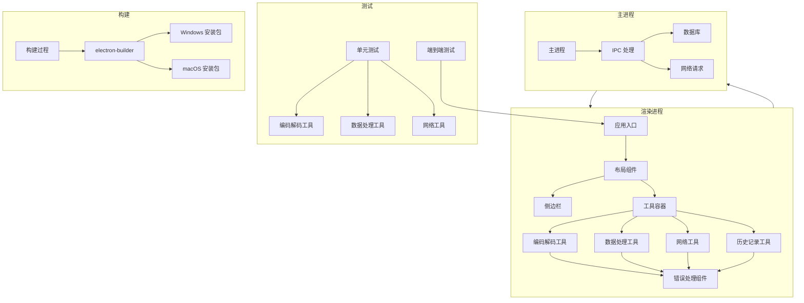

# 功能完善技术方案

## 1. 技术方案概述

**功能模块**: 功能完善 (Feature Complete)
**技术栈**: Electron + React + TypeScript + Tailwind CSS
**开发周期**: 2026-04-19 至 2026-04-25
**技术方案状态**: 📋 设计中

## 2. 现有代码分析

### 2.1 项目结构

```
src/
├── main/              # 主进程代码
│   ├── database/      # 数据库实现
│   ├── ipc/           # IPC 通信处理
│   └── index.ts       # 主进程入口
├── preload/           # 预加载脚本
└── renderer/          # 渲染进程代码
    ├── components/    # 通用组件
    ├── modules/       # 工具模块
    │   ├── data/      # 数据处理工具
    │   ├── encoder/   # 编码解码工具
    │   ├── history/   # 历史记录管理
    │   └── network/   # 网络工具
    ├── store/         # 状态管理
    └── App.tsx        # 应用入口
```

### 2.2 现有技术实现

- **前端**: React 18.x + Tailwind CSS + Zustand
- **桌面框架**: Electron 28.x + Vite + electron-vite
- **数据存储**: electron-store (实际使用) vs SQLite (技术栈文档)
- **网络请求**: axios
- **测试**: 已有部分单元测试文件

### 2.3 待优化的问题

1. **错误处理**: 各工具模块缺少完整的错误处理机制
2. **UI 优化**: 界面布局和用户体验需要进一步提升
3. **测试覆盖**: 测试用例覆盖不足
4. **打包配置**: electron-builder 配置需要完善

## 3. 详细技术方案

### 3.1 Phase 2.1: 功能优化与测试

#### 3.1.1 错误处理优化

**技术实现**:
- 创建统一的错误处理组件 `ErrorMessage.tsx`
- 在各工具组件中添加错误状态管理
- 实现全局错误边界组件
- 为网络请求和数据库操作添加错误处理

**关键代码结构**:
```tsx
// src/renderer/components/ErrorMessage.tsx
const ErrorMessage: React.FC<{ message: string; onClose?: () => void }> = ({ message, onClose }) => {
  return (
    <div className="p-4 bg-red-50 border border-red-200 rounded-md">
      <div className="flex items-start">
        <div className="flex-shrink-0">
          <AlertCircleIcon className="h-5 w-5 text-red-400" />
        </div>
        <div className="ml-3 flex-1">
          <h3 className="text-sm font-medium text-red-800">错误</h3>
          <div className="mt-2 text-sm text-red-700">
            <p>{message}</p>
          </div>
          {onClose && (
            <div className="mt-3">
              <button
                onClick={onClose}
                className="text-xs font-medium text-red-800 hover:text-red-700"
              >
                关闭
              </button>
            </div>
          )}
        </div>
      </div>
    </div>
  )
}
```

**对应验收标准**:
- AC-005: 网络工具错误处理
- AC-006: 编码解码工具错误处理
- AC-007: 数据处理工具错误处理
- AC-008: 网络错误处理
- AC-009: 数据库错误处理

#### 3.1.2 UI 优化

**技术实现**:
- 统一各工具的布局和样式
- 添加加载状态指示器
- 优化按钮和表单元素的交互体验
- 实现响应式设计，适配不同屏幕尺寸

**关键改进**:
- 为所有工具添加统一的卡片式布局
- 优化输入框和按钮的样式
- 添加操作反馈动画
- 统一错误提示和成功提示的样式

**对应验收标准**:
- AC-003: 工具界面加载和布局
- AC-004: 跨平台一致性

#### 3.1.3 测试完善

**技术实现**:
- 完善现有单元测试
- 添加缺失的单元测试
- 配置端到端测试框架
- 编写端到端测试用例

**测试框架配置**:
- **单元测试**: Jest + React Testing Library
- **端到端测试**: Playwright

**关键测试文件**:
| 模块 | 测试文件 | 测试内容 |
|------|---------|----------|
| 编码解码 | `src/renderer/modules/encoder/utils/*.test.ts` | 编码解码功能测试 |
| 数据处理 | `src/renderer/modules/data/utils/*.test.ts` | 数据处理功能测试 |
| 网络工具 | `src/renderer/modules/network/utils/*.test.ts` | 网络工具功能测试 |
| 历史记录 | `src/renderer/modules/history/__tests__/historyStore.test.ts` | 历史记录功能测试 |
| 端到端测试 | `tests/e2e/*.spec.ts` | 应用整体功能测试 |

**对应验收标准**:
- AC-010: 单元测试通过
- AC-011: 端到端测试通过

#### 3.1.4 性能优化

**技术实现**:
- 优化应用启动速度
- 优化工具操作响应时间
- 减少不必要的渲染
- 优化数据库操作性能

**关键优化点**:
1. **启动速度优化**:
   - 减少主进程启动时的同步操作
   - 延迟加载非关键模块
   - 优化资源加载顺序

2. **响应速度优化**:
   - 使用 React.memo 优化组件渲染
   - 优化状态更新逻辑
   - 使用 Web Worker 处理复杂计算

**对应验收标准**:
- AC-001: 应用启动时间 < 3 秒
- AC-002: 工具操作响应时间 < 500ms

### 3.2 Phase 2.2: 打包与发布

#### 3.2.1 electron-builder 配置

**技术实现**:
- 完善 electron-builder.yml 配置
- 配置 Windows 和 macOS 平台的构建选项
- 添加应用图标和版本信息
- 配置打包脚本

**关键配置文件**:
```yaml
# electron-builder.yml
appId: com.devtools.app
productName: DevTools
version: ${version}
copyright: Copyright (C) 2026

win:
  target: nsis
  icon: resources/icons/app.ico
  publisherName: DevTools

mac:
  target: dmg
  icon: resources/icons/app.icns
  category: public.app-category.developer-tools

nsis:
  oneClick: false
  perMachine: true
  allowElevation: true
  allowToChangeInstallationDirectory: true
  installerIcon: resources/icons/app.ico
  uninstallerIcon: resources/icons/app.ico
  installerHeaderIcon: resources/icons/app.ico
  createDesktopShortcut: always
  createStartMenuShortcut: true

publish:
  provider: github
  releaseType: release
```

**对应验收标准**:
- AC-014: 构建 Windows 安装包
- AC-015: 构建 macOS 安装包

#### 3.2.2 打包流程

**技术实现**:
- 配置构建脚本
- 实现构建前的检查
- 自动化构建过程
- 测试构建结果

**关键脚本**:
```json
// package.json
{
  "scripts": {
    "build": "electron-vite build",
    "build:win": "electron-vite build && electron-builder --win",
    "build:mac": "electron-vite build && electron-builder --mac",
    "build:all": "electron-vite build && electron-builder --win --mac",
    "test": "jest",
    "test:e2e": "playwright test"
  }
}
```

**对应验收标准**:
- AC-016: Windows 安装包安装测试
- AC-017: macOS 安装包安装测试
- AC-018: 构建错误处理

#### 3.2.3 发布准备

**技术实现**:
- 准备发布说明
- 配置版本号管理
- 准备发布资源

**关键文件**:
- `RELEASE.md`: 发布说明文档
- `CHANGELOG.md`: 变更日志
- 应用图标和资源文件

**对应验收标准**:
- AC-020: 版本号和发布说明
- AC-021: 依赖和资源包含

## 4. 技术架构图



## 5. 数据结构与接口

### 5.1 错误处理数据结构

```typescript
interface ErrorState {
  hasError: boolean
  message: string
  type: 'network' | 'input' | 'database' | 'other'
}

interface ToolState {
  input: string
  output: string
  error: ErrorState
  loading: boolean
}
```

### 5.2 IPC 接口

| 接口名称 | 方向 | 参数 | 响应 | 说明 |
|---------|------|------|------|------|
| `ping` | 渲染 → 主 | 无 | `string` | 测试 IPC 连接 |
| `db:init` | 渲染 → 主 | 无 | `{ success: boolean, error?: string }` | 初始化数据库 |
| `history:save` | 渲染 → 主 | `{ tool_type: string, input: string, output: string }` | `{ success: boolean, id?: number, error?: string }` | 保存历史记录 |
| `history:getAll` | 渲染 → 主 | `{ limit?: number, offset?: number }` | `{ success: boolean, data: HistoryRecord[], error?: string }` | 获取历史记录 |
| `history:delete` | 渲染 → 主 | `{ ids: number[] }` | `{ success: boolean, error?: string }` | 删除历史记录 |
| `history:clear` | 渲染 → 主 | 无 | `{ success: boolean, error?: string }` | 清空历史记录 |
| `favorites:save` | 渲染 → 主 | `{ tool_type: string, name: string, data: string }` | `{ success: boolean, id?: number, error?: string }` | 保存收藏 |
| `favorites:getAll` | 渲染 → 主 | `{ tool_type?: string }` | `{ success: boolean, data: FavoriteRecord[], error?: string }` | 获取收藏 |
| `favorites:delete` | 渲染 → 主 | `{ id: number }` | `{ success: boolean, error?: string }` | 删除收藏 |

## 6. 实现计划

### 6.1 Phase 2.1: 功能优化与测试

| 任务 | 描述 | 负责人 | 预计时间 | 依赖 |
|------|------|--------|----------|------|
| 1. 错误处理实现 | 创建错误处理组件，为各工具添加错误处理 | 开发者 | 2 天 | 无 |
| 2. UI 优化 | 统一各工具的布局和样式，提升用户体验 | 开发者 | 2 天 | 错误处理实现 |
| 3. 单元测试完善 | 完善现有单元测试，添加缺失的测试用例 | 开发者 | 1 天 | 无 |
| 4. 端到端测试配置 | 配置 Playwright，编写端到端测试用例 | 开发者 | 1 天 | 单元测试完善 |
| 5. 性能优化 | 优化应用启动速度和工具响应时间 | 开发者 | 1 天 | UI 优化 |
| 6. 测试执行 | 运行所有测试，修复发现的问题 | 开发者 | 1 天 | 所有测试配置完成 |

### 6.2 Phase 2.2: 打包与发布

| 任务 | 描述 | 负责人 | 预计时间 | 依赖 |
|------|------|--------|----------|------|
| 1. electron-builder 配置 | 完善 electron-builder 配置文件 | 开发者 | 1 天 | 无 |
| 2. Windows 构建 | 构建 Windows 安装包并测试 | 开发者 | 1 天 | electron-builder 配置 |
| 3. macOS 构建 | 构建 macOS 安装包并测试 | 开发者 | 1 天 | Windows 构建 |
| 4. 发布准备 | 准备发布说明和相关资源 | 开发者 | 1 天 | 所有构建完成 |

## 7. 风险与对策

### 7.1 风险分析

| 风险 | 影响 | 可能性 | 对策 |
|------|------|--------|------|
| 跨平台兼容性问题 | 应用在不同平台表现不一致 | 中 | 增加跨平台测试，使用 Electron 提供的跨平台 API |
| 构建环境配置问题 | 打包过程失败 | 中 | 提供详细的构建环境配置文档，使用容器化构建 |
| 测试覆盖不足 | 未发现的 bug 影响用户体验 | 中 | 增加测试用例，使用测试覆盖率工具 |
| 性能优化效果不明显 | 应用启动和响应速度未达标 | 低 | 使用性能分析工具，针对性优化 |

### 7.2 依赖管理

| 依赖 | 版本 | 用途 | 风险 |
|------|------|------|------|
| Electron | 28.x | 桌面应用框架 | 版本兼容性 |
| React | 18.x | 前端框架 | 低 |
| TypeScript | 5.x | 类型系统 | 低 |
| Tailwind CSS | 3.x | 样式方案 | 低 |
| electron-builder | 24.x | 打包工具 | 配置复杂度 |
| Jest | 29.x | 单元测试框架 | 低 |
| Playwright | 1.30.x | 端到端测试框架 | 配置复杂度 |

## 8. 验收标准覆盖

| 验收标准 | 技术实现 | 测试方法 |
|---------|----------|----------|
| AC-001 | 启动速度优化 | 测量应用启动时间 |
| AC-002 | 响应速度优化 | 测量工具操作响应时间 |
| AC-003 | UI 优化 | 手动测试界面布局和响应式设计 |
| AC-004 | 跨平台测试 | 在 Windows 和 macOS 平台测试 |
| AC-005 | 网络工具错误处理 | 输入无效 URL 测试 |
| AC-006 | 编码解码工具错误处理 | 输入无效数据测试 |
| AC-007 | 数据处理工具错误处理 | 输入无效正则表达式测试 |
| AC-008 | 网络错误处理 | 模拟网络连接不稳定测试 |
| AC-009 | 数据库错误处理 | 模拟数据库操作失败测试 |
| AC-010 | 单元测试 | 运行 `npm test` |
| AC-011 | 端到端测试 | 运行 `npm run test:e2e` |
| AC-012 | 结果复制功能 | 测试各工具的复制功能 |
| AC-013 | 工具状态保存 | 测试工具切换时的状态保存 |
| AC-014 | Windows 打包 | 运行 `npm run build:win` |
| AC-015 | macOS 打包 | 运行 `npm run build:mac` |
| AC-016 | Windows 安装测试 | 安装并运行 Windows 安装包 |
| AC-017 | macOS 安装测试 | 安装并运行 macOS 安装包 |
| AC-018 | 构建错误处理 | 模拟构建环境缺少依赖测试 |
| AC-019 | 安装要求提示 | 测试在缺少必要组件的系统上安装 |
| AC-020 | 版本号和发布说明 | 检查应用关于页面和发布说明 |
| AC-021 | 依赖和资源包含 | 检查安装包内容 |

## 9. 总结

本技术方案基于功能完善需求文档，详细说明了 Phase 2.1: 功能优化与测试和 Phase 2.2: 打包与发布的技术实现方案。方案涵盖了错误处理优化、UI 优化、测试完善、性能优化、打包配置等方面，确保应用在功能完善阶段能够达到预期的质量标准。

技术方案遵循项目现有的技术栈和代码结构，融入现有的设计模式和约定，确保新的实现能够与现有代码无缝集成。同时，方案覆盖了所有验收标准，为开发过程提供了明确的技术指导。

通过本技术方案的实施，应用将具备完整的错误处理机制、良好的用户界面、稳定的性能，以及可在 Windows 和 macOS 平台上正常运行的安装包，为最终用户提供稳定、可靠、易用的开发工具集合。