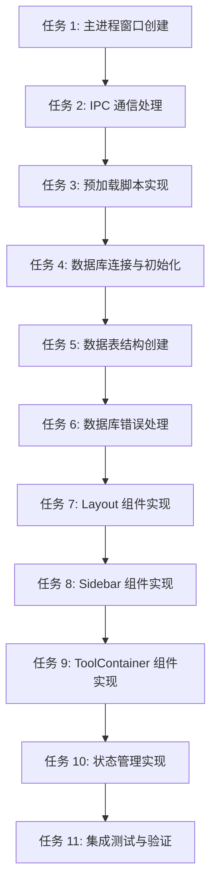

# 基础设施搭建任务规划

## 1. 任务规划概述

本任务规划基于基础设施搭建的技术方案，目标是将技术方案拆解为可执行的开发任务清单，每个任务适配 TDD 流程。任务规划覆盖基础框架搭建、数据库初始化和通用组件创建三个核心模块，确保项目具备完整的运行环境和基础结构。

## 2. 切片策略

由于基础设施搭建是纯技术功能，没有直接的用户可见行为，采用**技术模块切片**策略：

```
阶段一：基础框架搭建 → 阶段二：数据库初始化 → 阶段三：通用组件创建 → 阶段四：集成测试与验证
```

## 3. 任务依赖关系



## 4. 任务清单

### 阶段一：基础框架搭建

#### 任务 1: 主进程窗口创建
- **任务编号**: TASK-001
- **任务名称**: 实现主进程窗口创建
- **技术方案对应**: 4.1.1 窗口创建与管理
- **验收标准对应**: AC-002, AC-008
- **通俗解释**: 完成后应用能成功启动并显示主窗口
- **验证标准**:
  - 启动应用 → 显示主窗口，大小为 1000x700
  - 窗口关闭后 → 应用正确退出（Windows）或保持后台运行（macOS）
  - 系统资源不足时 → 捕获错误并显示友好提示
- **实现要点**:
  - 创建 BrowserWindow 实例
  - 配置窗口大小和 webPreferences
  - 处理应用生命周期事件
  - 实现错误处理

#### 任务 2: IPC 通信处理
- **任务编号**: TASK-002
- **任务名称**: 实现 IPC 通信处理
- **技术方案对应**: 4.1.2 IPC 通信处理
- **验收标准对应**: AC-003, AC-007
- **通俗解释**: 完成后主进程能处理渲染进程的 IPC 调用
- **验证标准**:
  - 渲染进程调用 ping → 主进程返回 "pong"
  - 调用异常时 → 主进程捕获错误并返回错误信息
- **实现要点**:
  - 实现 IPC 处理函数
  - 错误处理和异常捕获
  - 数据库操作的 IPC 处理

#### 任务 3: 预加载脚本实现
- **任务编号**: TASK-003
- **任务名称**: 实现预加载脚本
- **技术方案对应**: 4.2.1 上下文桥接
- **验收标准对应**: AC-003, AC-007
- **通俗解释**: 完成后渲染进程能安全调用主进程 API
- **验证标准**:
  - 渲染进程调用 electronAPI.ping → 返回 "pong"
  - 调用异常时 → 渲染进程捕获错误并显示友好提示
- **实现要点**:
  - 通过 contextBridge 暴露安全 API
  - 定义全局类型声明
  - 错误处理和异常捕获

### 阶段二：数据库初始化

#### 任务 4: 数据库连接与初始化
- **任务编号**: TASK-004
- **任务名称**: 实现数据库连接与初始化
- **技术方案对应**: 4.3.1 数据库初始化
- **验收标准对应**: AC-004, AC-006
- **通俗解释**: 完成后应用能成功连接和初始化数据库
- **验证标准**:
  - 应用首次启动 → 数据库文件创建成功
  - 数据库文件存在 → 连接成功
  - 连接失败 → 显示错误信息
- **实现要点**:
  - 初始化 SQLite 数据库连接
  - 处理数据库文件创建
  - 实现错误处理

#### 任务 5: 数据表结构创建
- **任务编号**: TASK-005
- **任务名称**: 创建数据表结构
- **技术方案对应**: 4.3.2 数据表设计
- **验收标准对应**: AC-004
- **通俗解释**: 完成后数据库包含必要的数据表结构
- **验证标准**:
  - 数据库初始化 → 创建 history 和 favorites 表
  - 表结构符合设计规范
- **实现要点**:
  - 创建历史记录表 (history)
  - 创建收藏表 (favorites)
  - 确保表结构正确

#### 任务 6: 数据库错误处理
- **任务编号**: TASK-006
- **任务名称**: 实现数据库错误处理
- **技术方案对应**: 7.1 数据库错误处理
- **验收标准对应**: AC-006
- **通俗解释**: 完成后应用能正确处理数据库错误
- **验证标准**:
  - 数据库文件创建失败 → 显示错误信息
  - 数据库连接失败 → 显示错误信息
  - SQL 执行错误 → 显示错误信息
- **实现要点**:
  - 捕获数据库错误
  - 通过 IPC 发送错误通知
  - 显示友好的错误信息

### 阶段三：通用组件创建

#### 任务 7: Layout 组件实现
- **任务编号**: TASK-007
- **任务名称**: 实现 Layout 布局组件
- **技术方案对应**: 4.4.1 通用组件 - Layout
- **验收标准对应**: AC-005
- **通俗解释**: 完成后应用有统一的布局结构
- **验证标准**:
  - 应用启动 → 显示布局组件
  - 布局包含 Sidebar 和主内容区域
- **实现要点**:
  - 提供应用的整体布局结构
  - 集成 Sidebar 和主内容区域
  - 响应式设计

#### 任务 8: Sidebar 组件实现
- **任务编号**: TASK-008
- **任务名称**: 实现 Sidebar 侧边栏组件
- **技术方案对应**: 4.4.1 通用组件 - Sidebar
- **验收标准对应**: AC-005
- **通俗解释**: 完成后应用有工具分类导航
- **验证标准**:
  - 应用启动 → 显示侧边栏
  - 侧边栏包含工具分类
  - 点击导航项 → 能触发相应操作
- **实现要点**:
  - 提供工具分类导航
  - 响应式设计，适配不同窗口大小
  - 导航项点击处理

#### 任务 9: ToolContainer 组件实现
- **任务编号**: TASK-009
- **任务名称**: 实现 ToolContainer 工具容器组件
- **技术方案对应**: 4.4.1 通用组件 - ToolContainer
- **验收标准对应**: AC-005
- **通俗解释**: 完成后应用有统一的工具界面布局
- **验证标准**:
  - 应用启动 → 显示工具容器
  - 工具容器能容纳不同工具的内容
  - 布局结构清晰
- **实现要点**:
  - 提供工具内容的容器
  - 统一的工具界面布局
  - 响应式设计

#### 任务 10: 状态管理实现
- **任务编号**: TASK-010
- **任务名称**: 实现状态管理
- **技术方案对应**: 4.4.2 状态管理
- **验收标准对应**: AC-005
- **通俗解释**: 完成后应用能管理工具切换和状态同步
- **验证标准**:
  - 切换工具 → 状态更新
  - 状态变化 → UI 同步更新
- **实现要点**:
  - 使用 Zustand 管理应用状态
  - 工具切换和状态同步
  - 状态持久化（可选）

### 阶段四：集成测试与验证

#### 任务 11: 集成测试与验证
- **任务编号**: TASK-011
- **任务名称**: 集成测试与验证
- **技术方案对应**: 10.4 阶段四：测试与验证
- **验收标准对应**: 所有 AC
- **通俗解释**: 完成后所有功能正常运行，符合验收标准
- **验证标准**:
  - 应用启动 → 成功显示主窗口
  - IPC 通信 → 测试成功
  - 数据库初始化 → 成功创建表结构
  - 通用组件 → 正确渲染
  - 错误处理 → 能正确处理异常情况
- **实现要点**:
  - 测试应用启动和窗口创建
  - 测试 IPC 通信功能
  - 测试数据库初始化功能
  - 测试通用组件渲染
  - 测试错误处理机制

## 5. 任务执行顺序

1. **TASK-001**: 主进程窗口创建 🔒
2. **TASK-002**: IPC 通信处理
3. **TASK-003**: 预加载脚本实现
4. **TASK-004**: 数据库连接与初始化 🔒
5. **TASK-005**: 数据表结构创建
6. **TASK-006**: 数据库错误处理
7. **TASK-007**: Layout 组件实现
8. **TASK-008**: Sidebar 组件实现
9. **TASK-009**: ToolContainer 组件实现
10. **TASK-010**: 状态管理实现
11. **TASK-011**: 集成测试与验证

## 6. 关键任务与风险提示

### 关键任务（🔒）
- **TASK-001**: 主进程窗口创建 - 所有后续功能的基础
- **TASK-004**: 数据库连接与初始化 - 数据存储的基础

### 风险提示（⚠️）
- **TASK-004**: 数据库连接与初始化 - 可能因权限或路径问题导致失败
- **TASK-006**: 数据库错误处理 - 需要确保错误信息友好且有针对性
- **TASK-011**: 集成测试与验证 - 需要在不同平台测试确保兼容性

## 7. 验证计划

| 验证项 | 关联任务 | 关联 AC | 验证方法 |
|-------|---------|--------|----------|
| 应用启动 | TASK-001 | AC-002 | 启动应用，检查窗口显示 |
| IPC 通信 | TASK-002, TASK-003 | AC-003 | 触发 IPC 调用，检查返回结果 |
| 数据库初始化 | TASK-004, TASK-005 | AC-004 | 检查数据库文件和表结构 |
| 数据库错误处理 | TASK-006 | AC-006 | 模拟数据库错误，检查错误处理 |
| 通用组件渲染 | TASK-007, TASK-008, TASK-009 | AC-005 | 检查组件渲染效果 |
| 状态管理 | TASK-010 | AC-005 | 测试状态切换和同步 |
| 窗口创建错误处理 | TASK-001 | AC-008 | 模拟窗口创建失败，检查错误处理 |
| IPC 通信错误处理 | TASK-002, TASK-003 | AC-007 | 模拟 IPC 通信失败，检查错误处理 |
| 平台兼容性 | TASK-011 | AC-011 | 在 Windows 和 macOS 测试 |

## 8. 任务完成标准

### 阶段一完成标准
- 应用能成功启动并显示主窗口
- IPC 通信功能正常
- 预加载脚本正确暴露 API

### 阶段二完成标准
- 数据库能成功初始化
- 数据表结构正确创建
- 数据库错误能正确处理

### 阶段三完成标准
- 通用组件正确渲染
- 布局结构清晰
- 状态管理功能正常

### 阶段四完成标准
- 所有功能正常运行
- 所有验收标准通过
- 应用在 Windows 和 macOS 平台均可正常运行

## 9. 预估工时

| 任务编号 | 任务名称 | 预估工时（小时） |
|---------|---------|----------------|
| TASK-001 | 主进程窗口创建 | 1.0 |
| TASK-002 | IPC 通信处理 | 1.0 |
| TASK-003 | 预加载脚本实现 | 0.5 |
| TASK-004 | 数据库连接与初始化 | 1.5 |
| TASK-005 | 数据表结构创建 | 0.5 |
| TASK-006 | 数据库错误处理 | 1.0 |
| TASK-007 | Layout 组件实现 | 0.5 |
| TASK-008 | Sidebar 组件实现 | 1.0 |
| TASK-009 | ToolContainer 组件实现 | 0.5 |
| TASK-010 | 状态管理实现 | 1.0 |
| TASK-011 | 集成测试与验证 | 2.0 |
| **总计** | | **10.5** |

## 10. 结论

本任务规划将基础设施搭建拆解为 11 个可执行的开发任务，每个任务都有明确的验证标准和实现要点。任务按照技术依赖关系排序，确保开发过程顺畅。通过本任务规划的实施，项目将具备完整的 Electron 应用基础设施，为后续的工具功能开发提供坚实的基础。