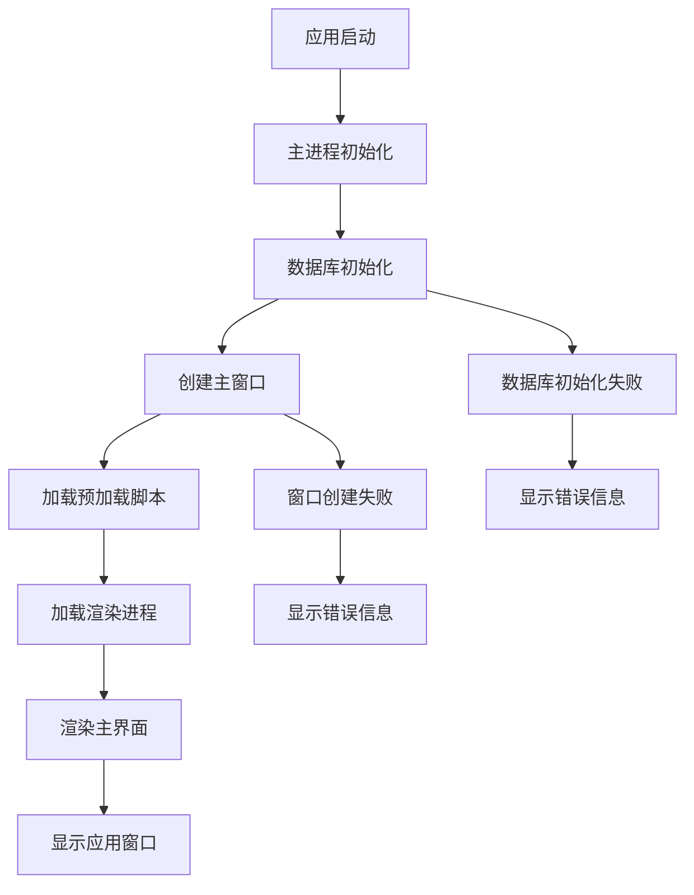
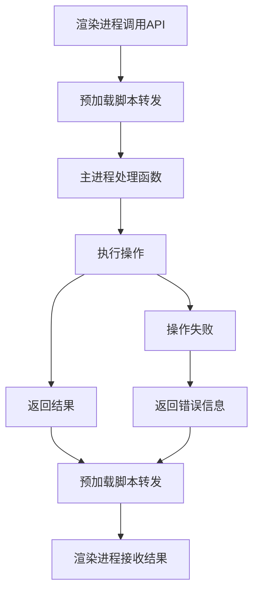
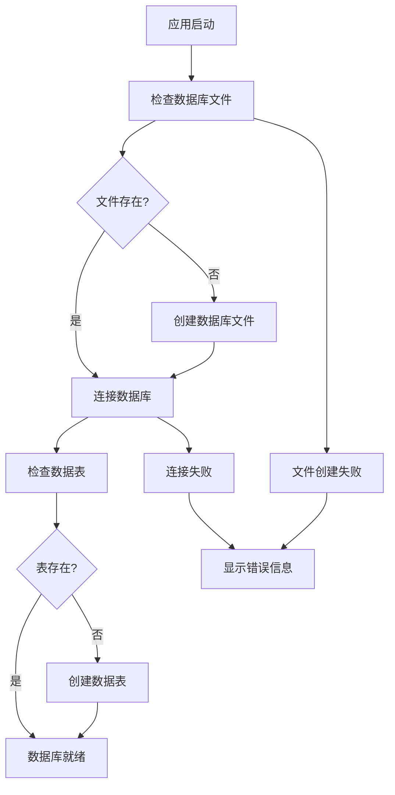

# 基础设施搭建技术方案

## 1. 技术方案概述

本技术方案基于项目需求文档，目标是搭建完整的 Electron 应用基础设施，为后续的工具功能开发提供基础框架。方案覆盖 Electron 基础框架、数据库初始化和通用组件创建三个核心模块，确保项目具备完整的运行环境和基础结构。

## 2. 技术栈与依赖

### 2.1 核心技术栈
- **Electron**: 跨平台桌面应用框架 → AC-009
- **React**: 前端 UI 库 → AC-009
- **TypeScript**: 类型安全的 JavaScript 超集 → AC-009
- **Vite**: 现代化构建工具 → AC-009
- **Tailwind CSS**: 实用优先的 CSS 框架 → AC-009
- **SQLite (better-sqlite3)**: 轻量级数据库 → AC-004

### 2.2 关键依赖
| 依赖名称 | 版本 | 用途 | 来源 |
|---------|------|------|------|
| electron | ^28.2.0 | 核心框架 | package.json |
| react | ^18.2.0 | 前端 UI | package.json |
| typescript | ^5.3.3 | 类型系统 | package.json |
| electron-vite | ^2.0.0 | 构建工具 | package.json |
| tailwindcss | ^3.4.1 | 样式库 | package.json |
| better-sqlite3 | ^9.4.3 | 数据库 | package.json |
| zustand | ^4.5.0 | 状态管理 | package.json |

## 3. 项目结构设计

```
src/
├── main/                  # 主进程
│   ├── database/          # 数据库相关
│   │   ├── index.ts       # 数据库初始化和管理
│   │   └── migrations/    # 数据库迁移脚本
│   ├── ipc/               # IPC 通信处理
│   │   └── handlers.ts    # IPC 处理函数
│   └── index.ts           # 主进程入口
├── preload/               # 预加载脚本
│   └── index.ts           # 预加载脚本入口
├── renderer/              # 渲染进程
│   ├── components/        # 通用组件
│   │   ├── Layout.tsx     # 布局组件
│   │   ├── Sidebar.tsx    # 侧边栏组件
│   │   └── ToolContainer.tsx # 工具容器组件
│   ├── modules/           # 工具模块
│   ├── store/             # 状态管理
│   ├── styles/            # 样式文件
│   ├── App.tsx            # 应用入口
│   └── main.tsx           # 渲染进程入口
└── types/                 # 类型定义
    └── index.ts           # 全局类型定义
```

## 4. 核心模块设计

### 4.1 主进程模块

#### 4.1.1 窗口创建与管理
- **实现文件**: `src/main/index.ts`
- **核心功能**:
  - 创建主窗口，设置窗口大小为 1000x700 → AC-002
  - 配置 webPreferences，启用 contextIsolation 和 preload 脚本 → AC-002
  - 处理应用生命周期事件（ready、activate、window-all-closed）→ AC-002
  - 窗口创建失败时的错误处理 → AC-008

#### 4.1.2 IPC 通信处理
- **实现文件**: `src/main/ipc/handlers.ts`
- **核心功能**:
  - 实现基础 IPC 通信处理函数 → AC-003
  - 错误处理和异常捕获 → AC-007
  - 数据库操作的 IPC 处理 → AC-004

### 4.2 预加载脚本模块

#### 4.2.1 上下文桥接
- **实现文件**: `src/preload/index.ts`
- **核心功能**:
  - 通过 contextBridge 暴露安全的 API 到渲染进程 → AC-003
  - 定义全局类型声明 → AC-003
  - 错误处理和异常捕获 → AC-007

### 4.3 数据库模块

#### 4.3.1 数据库初始化
- **实现文件**: `src/main/database/index.ts`
- **核心功能**:
  - 初始化 SQLite 数据库连接 → AC-004
  - 创建必要的数据表结构 → AC-004
  - 数据库初始化失败的错误处理 → AC-006

#### 4.3.2 数据表设计

**历史记录表 (history)**
| 字段名 | 类型 | 约束 | 描述 |
|-------|------|------|------|
| id | INTEGER | PRIMARY KEY AUTOINCREMENT | 记录 ID |
| tool_type | TEXT | NOT NULL | 工具类型 |
| input | TEXT | NOT NULL | 输入数据 |
| output | TEXT | NOT NULL | 输出数据 |
| created_at | TIMESTAMP | DEFAULT CURRENT_TIMESTAMP | 创建时间 |

**收藏表 (favorites)**
| 字段名 | 类型 | 约束 | 描述 |
|-------|------|------|------|
| id | INTEGER | PRIMARY KEY AUTOINCREMENT | 收藏 ID |
| tool_type | TEXT | NOT NULL | 工具类型 |
| name | TEXT | NOT NULL | 收藏名称 |
| data | TEXT | NOT NULL | 收藏数据 |
| created_at | TIMESTAMP | DEFAULT CURRENT_TIMESTAMP | 创建时间 |

### 4.4 渲染进程模块

#### 4.4.1 通用组件

**Layout 组件**
- **实现文件**: `src/renderer/components/Layout.tsx`
- **核心功能**:
  - 提供应用的整体布局结构 → AC-005
  - 集成 Sidebar 和主内容区域 → AC-005

**Sidebar 组件**
- **实现文件**: `src/renderer/components/Sidebar.tsx`
- **核心功能**:
  - 提供工具分类导航 → AC-005
  - 响应式设计，适配不同窗口大小 → AC-005

**ToolContainer 组件**
- **实现文件**: `src/renderer/components/ToolContainer.tsx`
- **核心功能**:
  - 提供工具内容的容器 → AC-005
  - 统一的工具界面布局 → AC-005

#### 4.4.2 状态管理
- **实现文件**: `src/renderer/store/index.ts`
- **核心功能**:
  - 使用 Zustand 管理应用状态 → AC-005
  - 工具切换和状态同步 → AC-005

## 5. 核心流程设计

### 5.1 应用启动流程



### 5.2 IPC 通信流程



### 5.3 数据库初始化流程



## 6. API 设计

### 6.1 主进程 IPC 接口

| 频道名称 | 方向 | 功能描述 | 参数 | 返回值 | 对应 AC |
|---------|------|---------|------|--------|--------|
| ping | 渲染→主 | 测试 IPC 通信 | 无 | `string` 成功消息 | AC-003 |
| db:init | 渲染→主 | 初始化数据库 | 无 | `boolean` 成功状态 | AC-004 |
| db:error | 主→渲染 | 数据库错误通知 | `string` 错误信息 | 无 | AC-006 |

### 6.2 渲染进程 API

| API 名称 | 功能描述 | 参数 | 返回值 | 对应 AC |
|---------|---------|------|--------|--------|
| electronAPI.ping | 测试 IPC 通信 | 无 | `Promise<string>` 成功消息 | AC-003 |
| electronAPI.initDatabase | 初始化数据库 | 无 | `Promise<boolean>` 成功状态 | AC-004 |

## 7. 错误处理与边界情况

### 7.1 数据库错误处理
- **实现方式**: 主进程捕获数据库错误，通过 IPC 发送错误通知到渲染进程
- **错误类型**:
  - 数据库文件创建失败 → AC-006
  - 数据库连接失败 → AC-006
  - SQL 执行错误 → AC-006
- **处理策略**: 显示友好的错误信息，提供修复建议

### 7.2 IPC 通信错误处理
- **实现方式**: 渲染进程捕获 IPC 调用错误，显示友好的错误提示
- **错误类型**:
  - 主进程无响应 → AC-007
  - 通信超时 → AC-007
  - 调用参数错误 → AC-007
- **处理策略**: 显示错误信息，提供重试选项

### 7.3 窗口创建错误处理
- **实现方式**: 主进程捕获窗口创建错误，记录日志并显示错误信息
- **错误类型**:
  - 系统资源不足 → AC-008
  - 权限问题 → AC-008
  - 配置错误 → AC-008
- **处理策略**: 显示错误信息，建议用户重启应用或检查系统状态

## 8. 性能优化

### 8.1 启动性能
- **优化策略**:
  - 延迟加载非关键模块
  - 优化主进程启动时间
  - 减少渲染进程初始化时间
- **目标**: 应用启动时间 < 3s → 符合产品概述要求

### 8.2 运行性能
- **优化策略**:
  - 数据库连接池管理
  - IPC 通信优化
  - 渲染进程内存管理
- **目标**: 工具操作响应 < 500ms → 符合产品概述要求

## 9. 平台兼容性

### 9.1 Windows 平台
- **适配策略**:
  - 处理 Windows 特有的窗口行为
  - 确保文件路径处理兼容 Windows 格式
  - 适配 Windows 系统的字体和显示设置

### 9.2 macOS 平台
- **适配策略**:
  - 处理 macOS 特有的窗口行为
  - 确保文件路径处理兼容 macOS 格式
  - 适配 macOS 系统的字体和显示设置

## 10. 实现计划

### 10.1 阶段一：基础框架搭建
- 完成主进程入口和窗口创建 → AC-002
- 完成预加载脚本和 IPC 通信基础 → AC-003
- 配置开发环境和生产环境 → AC-001

### 10.2 阶段二：数据库初始化
- 实现数据库连接和初始化逻辑 → AC-004
- 创建必要的数据表结构 → AC-004
- 实现数据库错误处理 → AC-006

### 10.3 阶段三：通用组件创建
- 完成 Layout 布局组件 → AC-005
- 完成 Sidebar 侧边栏组件 → AC-005
- 完成 ToolContainer 工具容器组件 → AC-005

### 10.4 阶段四：测试与验证
- 测试应用启动和窗口创建 → AC-002
- 测试 IPC 通信功能 → AC-003
- 测试数据库初始化功能 → AC-004
- 测试通用组件渲染 → AC-005
- 测试错误处理机制 → AC-006, AC-007, AC-008

## 11. 验收标准对应表

| 验收标准 | 技术实现 | 对应文件 |
|---------|---------|---------|
| AC-001: 项目初始化 | 依赖安装和配置 | package.json |
| AC-002: 主进程窗口创建 | 窗口创建和管理 | src/main/index.ts |
| AC-003: IPC 通信测试 | IPC 通信处理 | src/main/ipc/handlers.ts, src/preload/index.ts |
| AC-004: 数据库初始化 | 数据库连接和初始化 | src/main/database/index.ts |
| AC-005: 通用组件渲染 | 通用组件实现 | src/renderer/components/ |
| AC-006: 数据库初始化失败 | 数据库错误处理 | src/main/database/index.ts |
| AC-007: IPC 通信失败 | IPC 错误处理 | src/main/ipc/handlers.ts, src/preload/index.ts |
| AC-008: 窗口创建失败 | 窗口创建错误处理 | src/main/index.ts |
| AC-009: 技术栈使用 | 技术栈配置 | package.json |
| AC-010: 代码规范 | ESLint 和 Prettier 配置 | package.json |
| AC-011: 平台兼容性 | 跨平台适配 | src/main/index.ts |

## 12. 风险评估

| 风险 | 影响 | 缓解措施 |
|-----|------|---------|
| 数据库初始化失败 | 应用无法正常启动 | 实现错误处理和用户提示 |
| IPC 通信异常 | 功能无法正常使用 | 实现错误捕获和重试机制 |
| 窗口创建失败 | 应用无法显示 | 实现错误处理和日志记录 |
| 平台兼容性问题 | 在某些平台上运行异常 | 针对不同平台进行测试和适配 |
| 性能问题 | 应用启动慢或响应迟钝 | 优化启动流程和运行性能 |

## 13. 结论

本技术方案详细描述了基础设施搭建的技术实现，覆盖了所有验收标准，确保项目具备完整的运行环境和基础结构。方案采用了现代的技术栈和最佳实践，为后续的工具功能开发提供了坚实的基础。

通过本方案的实施，项目将具备以下能力：
- 完整的 Electron 应用框架
- 可靠的数据库存储
- 高效的 IPC 通信
- 统一的通用组件
- 良好的错误处理机制
- 跨平台兼容性

这些基础设施将为后续的编码解码、网络工具、数据处理等功能模块的开发提供有力支持。