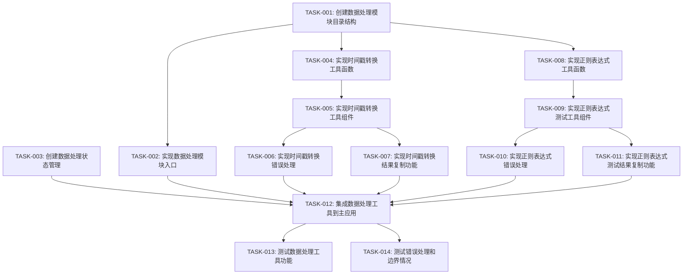

# 数据处理工具包任务规划

## 1. 任务规划概览

本任务规划基于数据处理工具包的需求文档和技术方案，采用垂直切片策略，将功能按用户行为拆分为独立可验证的切片。每个切片包含完整的技术实现，确保开发过程中能快速验证和反馈。

## 2. 切片划分

### 2.1 基础设施准备
- **描述**：为数据处理工具包准备必要的项目结构和基础设置
- **依赖**：无
- **可并行**：是

### 2.2 切片一：时间戳转换功能
- **描述**：实现时间戳与日期时间之间的相互转换功能
- **依赖**：基础设施准备
- **可并行**：否（需先完成基础设施准备）

### 2.3 切片二：正则表达式测试功能
- **描述**：实现正则表达式的匹配、替换和测试功能
- **依赖**：基础设施准备
- **可并行**：是（与切片一可并行开发）

### 2.4 切片三：状态管理与集成
- **描述**：实现数据处理工具的状态管理和主应用集成
- **依赖**：切片一、切片二
- **可并行**：否（需先完成切片一和切片二）

## 3. 详细任务清单

### 3.1 基础设施准备

| 任务编号 | 任务名称 | 通俗解释 | 技术实现 | 验证标准 | 对应 AC | 依赖任务 | 预估工时 |
|---------|---------|---------|---------|---------|---------|---------|----------|
| TASK-001 | 创建数据处理模块目录结构 | 建立数据处理工具包的目录结构，为后续开发做准备 | 创建 `src/renderer/modules/data/` 目录及其子目录 | 目录结构已创建，包含 components、utils 和 index.ts 文件 | 无 | 无 | 15分钟 |
| TASK-002 | 实现数据处理模块入口 | 创建数据处理模块的入口文件，导出工具组件 | 创建 `src/renderer/modules/data/index.ts` 文件，导出工具组件 | 入口文件已创建，能正确导出工具组件 | 无 | TASK-001 | 10分钟 |
| TASK-003 | 创建数据处理状态管理 | 实现数据处理工具的状态管理，用于管理工具切换和状态 | 创建 `src/renderer/store/dataStore.ts` 文件，实现状态管理逻辑 | 状态管理已实现，能管理当前工具和工具状态 | 无 | 无 | 20分钟 |

### 3.2 切片一：时间戳转换功能

| 任务编号 | 任务名称 | 通俗解释 | 技术实现 | 验证标准 | 对应 AC | 依赖任务 | 预估工时 |
|---------|---------|---------|---------|---------|---------|---------|----------|
| TASK-004 | 实现时间戳转换工具函数 | 开发时间戳与日期时间之间的转换函数 | 创建 `src/renderer/modules/data/utils/timestamp.ts` 文件，实现转换函数 | 时间戳转换函数能正确处理秒级和毫秒级时间戳，支持不同日期格式 | AC-001, AC-002, AC-003, AC-004, AC-008, AC-009 | TASK-001 | 45分钟 |
| TASK-005 | 实现时间戳转换工具组件 | 开发时间戳转换的用户界面组件 | 创建 `src/renderer/modules/data/components/TimestampTool.tsx` 文件，实现 UI 组件 | 时间戳转换工具界面完整，支持输入、转换和结果显示 | AC-001, AC-002, AC-003, AC-004 | TASK-004 | 60分钟 |
| TASK-006 | 实现时间戳转换错误处理 | 为时间戳转换功能添加错误处理机制 | 在 `timestamp.ts` 和 `TimestampTool.tsx` 中添加错误处理逻辑 | 能正确处理无效输入和边界情况，显示友好的错误提示 | AC-005, AC-006, AC-007 | TASK-004, TASK-005 | 20分钟 |
| TASK-007 | 实现时间戳转换结果复制功能 | 为时间戳转换工具添加结果复制功能 | 在 `TimestampTool.tsx` 中实现复制功能 | 点击复制按钮能将转换结果复制到剪贴板 | 本次实现范围 | TASK-005 | 15分钟 |

### 3.3 切片二：正则表达式测试功能

| 任务编号 | 任务名称 | 通俗解释 | 技术实现 | 验证标准 | 对应 AC | 依赖任务 | 预估工时 |
|---------|---------|---------|---------|---------|---------|---------|----------|
| TASK-008 | 实现正则表达式工具函数 | 开发正则表达式匹配和替换函数 | 创建 `src/renderer/modules/data/utils/regex.ts` 文件，实现正则处理函数 | 正则表达式函数能正确匹配和替换文本，支持标志设置 | AC-010, AC-011, AC-012, AC-016, AC-017 | TASK-001 | 45分钟 |
| TASK-009 | 实现正则表达式测试工具组件 | 开发正则表达式测试的用户界面组件 | 创建 `src/renderer/modules/data/components/RegexTool.tsx` 文件，实现 UI 组件 | 正则表达式测试工具界面完整，支持输入、匹配、替换和结果显示 | AC-010, AC-011, AC-012, AC-016, AC-017 | TASK-008 | 60分钟 |
| TASK-010 | 实现正则表达式错误处理 | 为正则表达式测试功能添加错误处理机制 | 在 `regex.ts` 和 `RegexTool.tsx` 中添加错误处理逻辑 | 能正确处理无效正则表达式和边界情况，显示友好的错误提示 | AC-013, AC-014, AC-015 | TASK-008, TASK-009 | 20分钟 |
| TASK-011 | 实现正则表达式测试结果复制功能 | 为正则表达式测试工具添加结果复制功能 | 在 `RegexTool.tsx` 中实现复制功能 | 点击复制按钮能将匹配或替换结果复制到剪贴板 | 本次实现范围 | TASK-009 | 15分钟 |

### 3.4 切片三：状态管理与集成

| 任务编号 | 任务名称 | 通俗解释 | 技术实现 | 验证标准 | 对应 AC | 依赖任务 | 预估工时 |
|---------|---------|---------|---------|---------|---------|---------|----------|
| TASK-012 | 集成数据处理工具到主应用 | 将数据处理工具包集成到主应用中 | 修改 `src/renderer/App.tsx` 和相关文件，集成数据处理工具 | 数据处理工具能在主应用中显示和使用 | 无 | TASK-002, TASK-003, TASK-005, TASK-009 | 20分钟 |
| TASK-013 | 测试数据处理工具功能 | 测试数据处理工具的所有功能 | 运行应用，测试时间戳转换和正则表达式测试功能 | 所有功能正常工作，符合验收标准 | 所有 AC | TASK-012 | 30分钟 |
| TASK-014 | 测试错误处理和边界情况 | 测试数据处理工具的错误处理和边界情况 | 输入无效数据，测试错误处理机制 | 能正确处理各种错误情况，显示友好的错误提示 | AC-005, AC-006, AC-007, AC-013, AC-014, AC-015 | TASK-012 | 20分钟 |

## 4. 依赖关系图

## 5. 关键任务标注

- 🔒 **TASK-001**: 创建数据处理模块目录结构 - 所有后续任务的基础
- 🔒 **TASK-004**: 实现时间戳转换工具函数 - 时间戳转换功能的核心
- 🔒 **TASK-008**: 实现正则表达式工具函数 - 正则表达式测试功能的核心
- ⚠️ **TASK-010**: 实现正则表达式错误处理 - 需要处理复杂的边界情况和性能问题

## 6. 执行计划

### 6.1 阶段一：基础设施准备（1小时）
- TASK-001: 创建数据处理模块目录结构
- TASK-002: 实现数据处理模块入口
- TASK-003: 创建数据处理状态管理

### 6.2 阶段二：核心功能实现（4小时）
- 切片一：时间戳转换功能
  - TASK-004: 实现时间戳转换工具函数
  - TASK-005: 实现时间戳转换工具组件
  - TASK-006: 实现时间戳转换错误处理
  - TASK-007: 实现时间戳转换结果复制功能
- 切片二：正则表达式测试功能
  - TASK-008: 实现正则表达式工具函数
  - TASK-009: 实现正则表达式测试工具组件
  - TASK-010: 实现正则表达式错误处理
  - TASK-011: 实现正则表达式测试结果复制功能

### 6.3 阶段三：集成与测试（1.5小时）
- TASK-012: 集成数据处理工具到主应用
- TASK-013: 测试数据处理工具功能
- TASK-014: 测试错误处理和边界情况

## 7. 总工时预估

- **基础设施准备**: 45分钟
- **核心功能实现**: 4小时
- **集成与测试**: 1.5小时
- **总计**: 6小时15分钟

## 8. 验证计划

| 验证项 | 关联任务 | 关联 AC | 验证方法 |
|--------|---------|---------|----------|
| 时间戳转换功能 | TASK-004, TASK-005 | AC-001, AC-002, AC-003 | 输入秒级和毫秒级时间戳，验证转换结果；输入日期时间，验证转换结果 |
| 时间戳格式选择 | TASK-004, TASK-005 | AC-004 | 选择不同的日期时间格式，验证转换结果 |
| 时间戳错误处理 | TASK-006 | AC-005, AC-006, AC-007 | 输入无效时间戳和日期时间，验证错误提示 |
| 正则表达式匹配 | TASK-008, TASK-009 | AC-010 | 输入正则表达式和测试文本，验证匹配结果 |
| 正则表达式替换 | TASK-008, TASK-009 | AC-011 | 输入正则表达式、测试文本和替换文本，验证替换结果 |
| 正则表达式实时更新 | TASK-008, TASK-009 | AC-012 | 修改正则表达式或测试文本，验证结果实时更新 |
| 正则表达式错误处理 | TASK-010 | AC-013, AC-014, AC-015 | 输入无效正则表达式和空测试文本，验证错误提示；测试复杂正则表达式的性能 |
| 正则表达式标志支持 | TASK-008, TASK-009 | AC-016 | 设置不同的正则表达式标志，验证匹配结果 |
| 匹配结果高亮 | TASK-008, TASK-009 | AC-017 | 验证匹配结果是否高亮显示 |
| 结果复制功能 | TASK-007, TASK-011 | 本次实现范围 | 点击复制按钮，验证结果是否复制到剪贴板 |
| 工具集成 | TASK-012 | 无 | 验证数据处理工具是否在主应用中正常显示和使用 |

## 9. 风险评估

| 风险 | 影响 | 缓解措施 | 关联任务 |
|-----|------|---------|---------|
| 时间戳转换精度问题 | 转换结果可能不准确 | 使用标准的时间处理方法，添加单元测试验证转换精度 | TASK-004 |
| 正则表达式匹配性能问题 | 复杂正则表达式可能导致应用卡顿 | 实现匹配超时机制，限制匹配时间 | TASK-010 |
| 无效输入处理 | 可能导致应用崩溃 | 严格的输入验证和错误处理 | TASK-006, TASK-010 |
| 工具切换状态丢失 | 用户体验不佳 | 完善的状态管理实现 | TASK-003 |

## 10. 结论

本任务规划详细描述了数据处理工具包的开发任务，采用垂直切片策略确保每个功能都能独立验证。通过合理的任务拆分和依赖管理，确保开发过程高效有序。

按照本规划执行，数据处理工具包将在约6小时内完成开发，具备时间戳转换和正则表达式测试功能，满足所有验收标准。