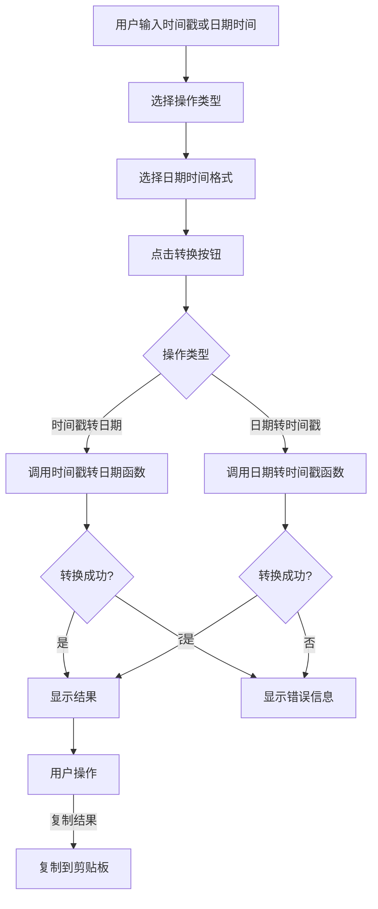
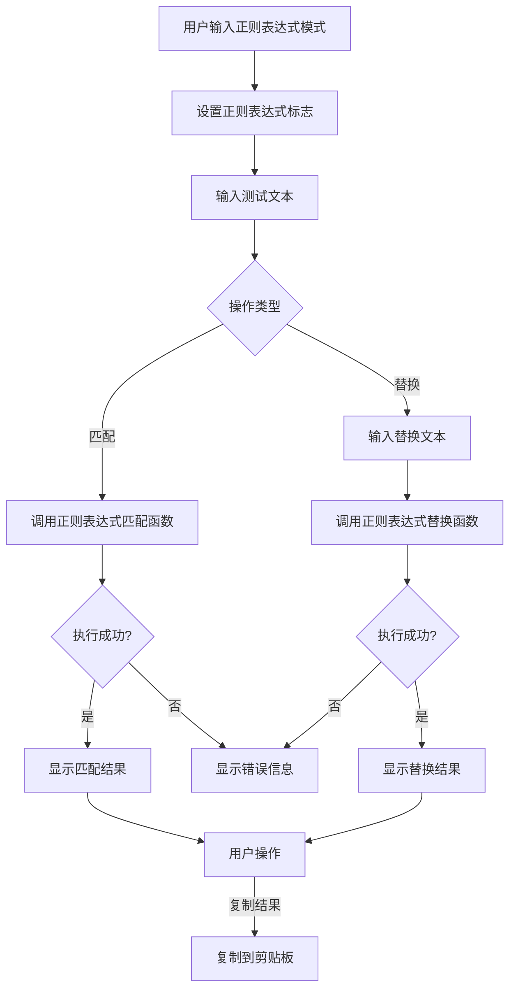

# 数据处理工具包技术方案

## 1. 技术方案概述

本技术方案基于数据处理工具包的需求文档，目标是实现时间戳转换和正则表达式测试功能。方案采用 React 组件化开发，结合 Electron 架构，确保功能完整且用户体验良好。

## 2. 技术栈与依赖

### 2.1 核心技术栈
- **React**: 前端 UI 库 → 所有 AC
- **TypeScript**: 类型安全的 JavaScript 超集 → 所有 AC
- **Tailwind CSS**: 实用优先的 CSS 框架 → 所有 AC
- **Electron**: 跨平台桌面应用框架 → 所有 AC

### 2.2 关键依赖
| 依赖名称 | 版本 | 用途 | 来源 |
|---------|------|------|------|
| react | ^18.2.0 | 前端 UI | package.json |
| typescript | ^5.3.3 | 类型系统 | package.json |
| tailwindcss | ^3.4.1 | 样式库 | package.json |
| zustand | ^4.5.0 | 状态管理 | package.json |

## 3. 项目结构设计

```
src/
├── renderer/
│   ├── components/        # 通用组件
│   ├── modules/           # 工具模块
│   │   └── data/          # 数据处理工具包
│   │       ├── components/ # 数据处理组件
│   │       │   ├── TimestampTool.tsx # 时间戳转换工具组件
│   │       │   └── RegexTool.tsx     # 正则表达式测试工具组件
│   │       ├── utils/      # 数据处理工具函数
│   │       │   ├── timestamp.ts      # 时间戳转换函数
│   │       │   └── regex.ts          # 正则表达式处理函数
│   │       └── index.ts    # 数据处理模块入口
│   ├── store/             # 状态管理
│   │   └── dataStore.ts   # 数据处理工具状态
│   └── App.tsx            # 应用入口
└── types/                 # 类型定义
    └── data.ts            # 数据处理相关类型
```

## 4. 核心模块设计

### 4.1 数据处理工具组件

#### 4.1.1 TimestampTool 组件
- **实现文件**: `src/renderer/modules/data/components/TimestampTool.tsx`
- **核心功能**:
  - 提供时间戳与日期时间转换界面 → AC-001, AC-002, AC-003
  - 支持时间戳和日期时间输入 → AC-001, AC-002, AC-003
  - 实现转换操作切换 → AC-001, AC-002, AC-003
  - 支持不同日期时间格式选择 → AC-004
  - 错误处理和提示 → AC-005, AC-006, AC-007
  - 结果复制功能 → 本次实现范围

#### 4.1.2 RegexTool 组件
- **实现文件**: `src/renderer/modules/data/components/RegexTool.tsx`
- **核心功能**:
  - 提供正则表达式测试界面 → AC-010, AC-011
  - 支持正则表达式模式和测试文本输入 → AC-010, AC-011
  - 实现匹配和替换操作 → AC-010, AC-011
  - 实时更新匹配结果 → AC-012
  - 错误处理和提示 → AC-013, AC-014, AC-015
  - 支持正则表达式标志设置 → AC-016
  - 高亮显示匹配结果 → AC-017
  - 结果复制功能 → 本次实现范围

### 4.2 数据处理工具函数

#### 4.2.1 时间戳工具函数
- **实现文件**: `src/renderer/modules/data/utils/timestamp.ts`
- **核心功能**:
  - 时间戳转日期时间函数 → AC-001, AC-002
  - 日期时间转时间戳函数 → AC-003
  - 时间戳格式自动识别 → AC-008
  - 无效输入检测 → AC-005, AC-006, AC-007
  - 日期时间格式处理 → AC-004, AC-009

#### 4.2.2 正则表达式工具函数
- **实现文件**: `src/renderer/modules/data/utils/regex.ts`
- **核心功能**:
  - 正则表达式匹配函数 → AC-010, AC-012
  - 正则表达式替换函数 → AC-011
  - 无效正则表达式检测 → AC-013
  - 正则表达式标志处理 → AC-016
  - 匹配结果高亮处理 → AC-017
  - 匹配超时处理 → AC-015

### 4.3 状态管理

#### 4.3.1 数据处理工具状态
- **实现文件**: `src/renderer/store/dataStore.ts`
- **核心功能**:
  - 管理当前选中的工具 → 工具切换需求
  - 保存各工具的状态 → 工具状态管理
  - 处理工具切换逻辑 → 工具切换需求

## 5. 核心流程设计

### 5.1 时间戳转换流程



### 5.2 正则表达式测试流程



## 6. API 设计

### 6.1 工具函数 API

| 函数名称 | 功能描述 | 参数 | 返回值 | 对应 AC |
|---------|---------|------|--------|--------|
| `timestampToDate` | 时间戳转日期时间 | `timestamp: string | number, format?: string` | `string` 日期时间字符串 | AC-001, AC-002, AC-004, AC-008 |
| `dateToTimestamp` | 日期时间转时间戳 | `date: string, unit?: 'seconds' | 'milliseconds'` | `{ seconds: number, milliseconds: number }` 时间戳对象 | AC-003 |
| `testRegex` | 正则表达式匹配 | `pattern: string, text: string, flags?: string` | `{ matches: Array<{ text: string, index: number }>, groups: any }` 匹配结果 | AC-010, AC-012, AC-016 |
| `replaceRegex` | 正则表达式替换 | `pattern: string, text: string, replacement: string, flags?: string` | `string` 替换结果 | AC-011, AC-016 |

### 6.2 状态管理 API

| 方法名称 | 功能描述 | 参数 | 返回值 | 对应需求 |
|---------|---------|------|--------|----------|
| `setCurrentTool` | 设置当前工具 | `tool: 'timestamp' | 'regex'` | `void` | 工具切换 |
| `setToolState` | 设置工具状态 | `tool: string, state: any` | `void` | 工具状态管理 |
| `getToolState` | 获取工具状态 | `tool: string` | `any` 工具状态 | 工具状态管理 |

## 7. 错误处理与边界情况

### 7.1 输入验证
- **实现方式**: 在工具函数中进行输入验证
- **错误类型**:
  - 空输入 → 通用错误处理
  - 无效的时间戳格式 → AC-005
  - 无效的日期时间格式 → AC-006
  - 超出范围的时间戳 → AC-007
  - 无效的正则表达式模式 → AC-013
  - 空的测试文本 → AC-014
- **处理策略**: 显示友好的错误提示，阻止执行操作

### 7.2 性能处理
- **实现方式**: 使用高效的处理方法
- **处理策略**:
  - 优化字符串处理算法
  - 使用防抖处理避免频繁执行
  - 对正则表达式匹配设置超时 → AC-015

### 7.3 复制功能错误处理
- **实现方式**: 捕获复制操作的异常
- **处理策略**:
  - 复制失败时显示错误提示
  - 提供手动复制的选项

## 8. 性能优化

### 8.1 渲染性能
- **优化策略**:
  - 使用 React.memo 优化组件渲染
  - 避免不必要的重渲染
  - 使用防抖处理输入变化

### 8.2 计算性能
- **优化策略**:
  - 使用高效的时间戳转换算法
  - 避免重复计算
  - 对正则表达式匹配设置合理的超时 → AC-015

## 9. 实现计划

### 9.1 阶段一：工具函数实现
- 实现时间戳转换函数 → AC-001, AC-002, AC-003, AC-004, AC-005, AC-006, AC-007, AC-008, AC-009
- 实现正则表达式处理函数 → AC-010, AC-011, AC-012, AC-013, AC-014, AC-015, AC-016, AC-017

### 9.2 阶段二：工具组件实现
- 实现 TimestampTool 组件 → AC-001, AC-002, AC-003, AC-004, AC-005, AC-006, AC-007, AC-008, AC-009
- 实现 RegexTool 组件 → AC-010, AC-011, AC-012, AC-013, AC-014, AC-015, AC-016, AC-017

### 9.3 阶段三：状态管理实现
- 实现数据处理工具状态管理 → 工具切换和状态管理需求
- 集成工具切换逻辑 → 工具切换需求

### 9.4 阶段四：集成与测试
- 集成到主应用 → 功能集成需求
- 测试各工具功能 → 所有 AC
- 测试错误处理机制 → AC-005, AC-006, AC-007, AC-013, AC-014, AC-015
- 测试性能优化 → AC-015

## 10. 验收标准对应表

| 验收标准 | 技术实现 | 对应文件 |
|---------|---------|---------|
| AC-001: 秒级时间戳转日期时间 | 时间戳转换函数和组件 | src/renderer/modules/data/utils/timestamp.ts, src/renderer/modules/data/components/TimestampTool.tsx |
| AC-002: 毫秒级时间戳转日期时间 | 时间戳转换函数和组件 | src/renderer/modules/data/utils/timestamp.ts, src/renderer/modules/data/components/TimestampTool.tsx |
| AC-003: 日期时间转时间戳 | 时间戳转换函数和组件 | src/renderer/modules/data/utils/timestamp.ts, src/renderer/modules/data/components/TimestampTool.tsx |
| AC-004: 日期时间格式选择 | 时间戳转换函数和组件 | src/renderer/modules/data/utils/timestamp.ts, src/renderer/modules/data/components/TimestampTool.tsx |
| AC-005: 无效时间戳格式处理 | 输入验证和错误处理 | src/renderer/modules/data/utils/timestamp.ts |
| AC-006: 无效日期时间格式处理 | 输入验证和错误处理 | src/renderer/modules/data/utils/timestamp.ts |
| AC-007: 超出范围时间戳处理 | 输入验证和错误处理 | src/renderer/modules/data/utils/timestamp.ts |
| AC-008: 时间戳格式自动识别 | 时间戳转换函数 | src/renderer/modules/data/utils/timestamp.ts |
| AC-009: 默认日期时间格式 | 时间戳转换函数 | src/renderer/modules/data/utils/timestamp.ts |
| AC-010: 正则表达式匹配 | 正则表达式处理函数和组件 | src/renderer/modules/data/utils/regex.ts, src/renderer/modules/data/components/RegexTool.tsx |
| AC-011: 正则表达式替换 | 正则表达式处理函数和组件 | src/renderer/modules/data/utils/regex.ts, src/renderer/modules/data/components/RegexTool.tsx |
| AC-012: 实时更新匹配结果 | 正则表达式处理函数和组件 | src/renderer/modules/data/utils/regex.ts, src/renderer/modules/data/components/RegexTool.tsx |
| AC-013: 无效正则表达式处理 | 输入验证和错误处理 | src/renderer/modules/data/utils/regex.ts |
| AC-014: 空测试文本处理 | 输入验证和错误处理 | src/renderer/modules/data/components/RegexTool.tsx |
| AC-015: 正则表达式匹配超时处理 | 性能优化和错误处理 | src/renderer/modules/data/utils/regex.ts |
| AC-016: 正则表达式标志支持 | 正则表达式处理函数和组件 | src/renderer/modules/data/utils/regex.ts, src/renderer/modules/data/components/RegexTool.tsx |
| AC-017: 匹配结果高亮显示 | 正则表达式处理函数和组件 | src/renderer/modules/data/utils/regex.ts, src/renderer/modules/data/components/RegexTool.tsx |

## 11. 风险评估

| 风险 | 影响 | 缓解措施 |
|-----|------|---------|
| 时间戳转换精度问题 | 转换结果可能不准确 | 使用标准的时间处理库，确保转换精度 |
| 正则表达式匹配性能问题 | 复杂正则表达式可能导致应用卡顿 | 实现匹配超时机制，限制匹配时间 |
| 无效输入处理 | 可能导致应用崩溃 | 严格的输入验证和错误处理 |
| 工具切换状态丢失 | 用户体验不佳 | 完善的状态管理实现 |

## 12. 结论

本技术方案详细描述了数据处理工具包的技术实现，覆盖了所有验收标准，确保功能完整且用户体验良好。方案采用了组件化设计，将工具函数与 UI 组件分离，提高了代码的可维护性和可测试性。

通过本方案的实施，数据处理工具包将具备以下能力：
- 时间戳与日期时间的相互转换功能
- 正则表达式测试和验证功能
- 结果复制功能
- 良好的错误处理机制
- 高效的性能处理能力

这些功能将为开发者提供便捷的数据处理工具，帮助他们在开发过程中快速处理各种数据转换和验证需求，提高开发效率。