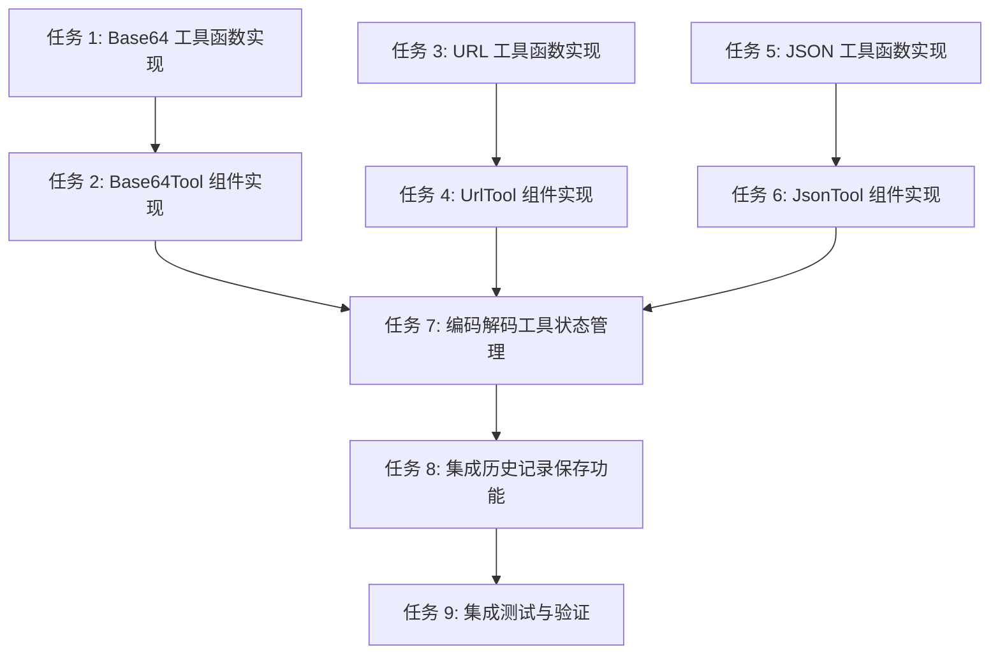

# 编码解码工具包任务规划

## 1. 任务规划概述

本任务规划基于编码解码工具包的技术方案，目标是将技术方案拆解为可执行的开发任务清单，每个任务适配 TDD 流程。任务规划覆盖 Base64 编码/解码、URL 编码/解码和 JSON 格式化/压缩功能，确保功能完整且用户体验良好。

## 2. 切片策略

采用**垂直切片**策略，每个切片对应一个完整的工具功能：

```
阶段一：Base64 工具 → 阶段二：URL 工具 → 阶段三：JSON 工具 → 阶段四：状态管理 → 阶段五：集成测试与验证
```

## 3. 任务依赖关系



## 4. 任务清单

### 阶段一：Base64 工具

#### 任务 1: Base64 工具函数实现
- **任务编号**: TASK-001
- **任务名称**: 实现 Base64 编码/解码函数
- **技术方案对应**: 4.2.1 Base64 工具函数
- **验收标准对应**: AC-001, AC-002, AC-009, AC-014, AC-013
- **通俗解释**: 完成后系统能对文本进行 Base64 编码和解码
- **验证标准**:
  - 输入文本 "Hello World" → 编码结果为 "SGVsbG8gV29ybGQ="
  - 输入 Base64 "SGVsbG8gV29ybGQ=" → 解码结果为 "Hello World"
  - 输入无效 Base64 → 抛出错误提示
  - 输入 10KB+ 文本 → 处理无卡顿
- **实现要点**:
  - 实现 base64Encode 函数
  - 实现 base64Decode 函数
  - 实现输入验证
  - 优化大文本处理性能

#### 任务 2: Base64Tool 组件实现
- **任务编号**: TASK-002
- **任务名称**: 实现 Base64Tool 组件
- **技术方案对应**: 4.1.1 Base64Tool 组件
- **验收标准对应**: AC-001, AC-002, AC-007, AC-008, AC-009, AC-012
- **通俗解释**: 完成后用户能通过界面使用 Base64 编码/解码功能
- **验证标准**:
  - 打开 Base64 工具页面 → 显示输入框和操作选项
  - 输入文本并选择编码 → 显示编码结果
  - 输入 Base64 并选择解码 → 显示解码结果
  - 点击复制按钮 → 结果复制到剪贴板
  - 点击保存按钮 → 操作记录保存到历史
  - 输入为空 → 显示错误提示
- **实现要点**:
  - 实现组件 UI 布局
  - 集成 Base64 工具函数
  - 实现操作类型切换
  - 实现结果复制功能
  - 实现历史记录保存
  - 实现错误处理

### 阶段二：URL 工具

#### 任务 3: URL 工具函数实现
- **任务编号**: TASK-003
- **任务名称**: 实现 URL 编码/解码函数
- **技术方案对应**: 4.2.2 URL 工具函数
- **验收标准对应**: AC-003, AC-004, AC-010, AC-015, AC-013
- **通俗解释**: 完成后系统能对 URL 进行编码和解码
- **验证标准**:
  - 输入 URL "https://example.com?name=测试" → 编码结果为 "https%3A%2F%2Fexample.com%3Fname%3D%E6%B5%8B%E8%AF%95"
  - 输入编码 URL "https%3A%2F%2Fexample.com%3Fname%3D%E6%B5%8B%E8%AF%95" → 解码结果为 "https://example.com?name=测试"
  - 输入无效 URL 编码 → 抛出错误提示
  - 输入 10KB+ URL → 处理无卡顿
- **实现要点**:
  - 实现 urlEncode 函数
  - 实现 urlDecode 函数
  - 实现输入验证
  - 优化大文本处理性能

#### 任务 4: UrlTool 组件实现
- **任务编号**: TASK-004
- **任务名称**: 实现 UrlTool 组件
- **技术方案对应**: 4.1.2 UrlTool 组件
- **验收标准对应**: AC-003, AC-004, AC-007, AC-008, AC-010, AC-012
- **通俗解释**: 完成后用户能通过界面使用 URL 编码/解码功能
- **验证标准**:
  - 打开 URL 工具页面 → 显示输入框和操作选项
  - 输入 URL 并选择编码 → 显示编码结果
  - 输入编码 URL 并选择解码 → 显示解码结果
  - 点击复制按钮 → 结果复制到剪贴板
  - 点击保存按钮 → 操作记录保存到历史
  - 输入为空 → 显示错误提示
- **实现要点**:
  - 实现组件 UI 布局
  - 集成 URL 工具函数
  - 实现操作类型切换
  - 实现结果复制功能
  - 实现历史记录保存
  - 实现错误处理

### 阶段三：JSON 工具

#### 任务 5: JSON 工具函数实现
- **任务编号**: TASK-005
- **任务名称**: 实现 JSON 格式化/压缩函数
- **技术方案对应**: 4.2.3 JSON 工具函数
- **验收标准对应**: AC-005, AC-006, AC-011, AC-016, AC-013
- **通俗解释**: 完成后系统能对 JSON 数据进行格式化和压缩
- **验证标准**:
  - 输入压缩 JSON "{"name":"test","value":123}" → 格式化结果有缩进
  - 输入格式化 JSON → 压缩结果为紧凑格式
  - 输入无效 JSON → 抛出错误提示
  - 输入 10KB+ JSON → 处理无卡顿
- **实现要点**:
  - 实现 jsonFormat 函数
  - 实现 jsonCompress 函数
  - 实现输入验证
  - 优化大文本处理性能

#### 任务 6: JsonTool 组件实现
- **任务编号**: TASK-006
- **任务名称**: 实现 JsonTool 组件
- **技术方案对应**: 4.1.3 JsonTool 组件
- **验收标准对应**: AC-005, AC-006, AC-007, AC-008, AC-011, AC-012
- **通俗解释**: 完成后用户能通过界面使用 JSON 格式化/压缩功能
- **验证标准**:
  - 打开 JSON 工具页面 → 显示输入框和操作选项
  - 输入 JSON 并选择格式化 → 显示格式化结果
  - 输入 JSON 并选择压缩 → 显示压缩结果
  - 点击复制按钮 → 结果复制到剪贴板
  - 点击保存按钮 → 操作记录保存到历史
  - 输入为空 → 显示错误提示
- **实现要点**:
  - 实现组件 UI 布局
  - 集成 JSON 工具函数
  - 实现操作类型切换
  - 实现结果复制功能
  - 实现历史记录保存
  - 实现错误处理

### 阶段四：状态管理

#### 任务 7: 编码解码工具状态管理
- **任务编号**: TASK-007
- **任务名称**: 实现编码解码工具状态管理
- **技术方案对应**: 4.3.1 编码解码工具状态
- **验收标准对应**: AC-017
- **通俗解释**: 完成后系统能管理工具切换和状态保存
- **验证标准**:
  - 切换工具 → 保存当前工具状态
  - 重新打开工具 → 恢复之前的状态
  - 工具切换流畅无卡顿
- **实现要点**:
  - 使用 Zustand 创建状态管理
  - 实现工具切换逻辑
  - 实现状态持久化

### 阶段五：集成测试与验证

#### 任务 8: 集成历史记录保存功能
- **任务编号**: TASK-008
- **任务名称**: 集成历史记录保存功能
- **技术方案对应**: 4.4.1 历史记录保存
- **验收标准对应**: AC-008
- **通俗解释**: 完成后所有工具的操作记录能保存到历史记录
- **验证标准**:
  - 执行编码/解码操作 → 记录保存到历史
  - 查看历史记录 → 显示操作记录
  - 保存操作失败 → 显示错误提示
- **实现要点**:
  - 集成数据库历史记录功能
  - 实现错误处理

#### 任务 9: 集成测试与验证
- **任务编号**: TASK-009
- **任务名称**: 集成测试与验证
- **技术方案对应**: 9.4 阶段四：集成与测试
- **验收标准对应**: 所有 AC
- **通俗解释**: 完成后所有功能正常运行，符合验收标准
- **验证标准**:
  - 所有工具功能正常 → 符合 AC-001 至 AC-006
  - 结果复制功能正常 → 符合 AC-007
  - 历史记录保存功能正常 → 符合 AC-008
  - 错误处理机制正常 → 符合 AC-009 至 AC-012
  - 大文本处理正常 → 符合 AC-013
  - 工具切换功能正常 → 符合 AC-017
- **实现要点**:
  - 测试各工具功能
  - 测试错误处理机制
  - 测试大文本处理
  - 测试工具切换功能
  - 测试历史记录保存

## 5. 任务执行顺序

1. **TASK-001**: Base64 工具函数实现
2. **TASK-002**: Base64Tool 组件实现
3. **TASK-003**: URL 工具函数实现
4. **TASK-004**: UrlTool 组件实现
5. **TASK-005**: JSON 工具函数实现
6. **TASK-006**: JsonTool 组件实现
7. **TASK-007**: 编码解码工具状态管理 🔒
8. **TASK-008**: 集成历史记录保存功能
9. **TASK-009**: 集成测试与验证 ⚠️

## 6. 关键任务与风险提示

### 关键任务（🔒）
- **TASK-007**: 编码解码工具状态管理 - 所有工具切换的基础

### 风险提示（⚠️）
- **TASK-009**: 集成测试与验证 - 需要全面测试所有功能和边界情况
- **TASK-001, TASK-003, TASK-005**: 工具函数实现 - 大文本处理可能存在性能问题
- **TASK-008**: 集成历史记录保存功能 - 可能因数据库连接问题导致保存失败

## 7. 验证计划

| 验证项 | 关联任务 | 关联 AC | 验证方法 |
|-------|---------|--------|----------|
| Base64 编码/解码 | TASK-001, TASK-002 | AC-001, AC-002, AC-009 | 输入文本和 Base64 进行编码/解码测试 |
| URL 编码/解码 | TASK-003, TASK-004 | AC-003, AC-004, AC-010 | 输入 URL 进行编码/解码测试 |
| JSON 格式化/压缩 | TASK-005, TASK-006 | AC-005, AC-006, AC-011 | 输入 JSON 进行格式化/压缩测试 |
| 结果复制功能 | TASK-002, TASK-004, TASK-006 | AC-007 | 点击复制按钮测试 |
| 历史记录保存 | TASK-002, TASK-004, TASK-006, TASK-008 | AC-008 | 执行操作并查看历史记录 |
| 空输入处理 | TASK-002, TASK-004, TASK-006 | AC-012 | 不输入内容直接执行测试 |
| 大文本处理 | TASK-001, TASK-003, TASK-005 | AC-013 | 输入 10KB+ 文本测试 |
| 工具切换 | TASK-007 | AC-017 | 切换不同工具测试状态保存 |
| 集成测试 | TASK-009 | 所有 AC | 全面测试所有功能 |

## 8. 任务完成标准

### 阶段一完成标准
- Base64 编码/解码功能正常
- Base64Tool 组件界面完整
- 结果复制和历史记录保存功能正常

### 阶段二完成标准
- URL 编码/解码功能正常
- UrlTool 组件界面完整
- 结果复制和历史记录保存功能正常

### 阶段三完成标准
- JSON 格式化/压缩功能正常
- JsonTool 组件界面完整
- 结果复制和历史记录保存功能正常

### 阶段四完成标准
- 工具切换功能正常
- 状态保存和恢复功能正常

### 阶段五完成标准
- 所有功能正常运行
- 所有验收标准通过
- 无性能问题和错误

## 9. 预估工时

| 任务编号 | 任务名称 | 预估工时（小时） |
|---------|---------|----------------|
| TASK-001 | Base64 工具函数实现 | 1.0 |
| TASK-002 | Base64Tool 组件实现 | 1.5 |
| TASK-003 | URL 工具函数实现 | 1.0 |
| TASK-004 | UrlTool 组件实现 | 1.5 |
| TASK-005 | JSON 工具函数实现 | 1.0 |
| TASK-006 | JsonTool 组件实现 | 1.5 |
| TASK-007 | 编码解码工具状态管理 | 1.0 |
| TASK-008 | 集成历史记录保存功能 | 0.5 |
| TASK-009 | 集成测试与验证 | 2.0 |
| **总计** | | **11.0** |

## 10. 结论

本任务规划将编码解码工具包拆解为 9 个可执行的开发任务，每个任务都有明确的验证标准和实现要点。任务按照垂直切片策略组织，确保每个工具功能都能独立验证和交付。

通过本任务规划的实施，编码解码工具包将具备完整的 Base64 编码/解码、URL 编码/解码和 JSON 格式化/压缩功能，以及结果复制、历史记录保存和工具切换等辅助功能。这些功能将为开发者提供便捷的编码解码工具，帮助他们在开发过程中快速处理各种编码解码需求，提高开发效率。