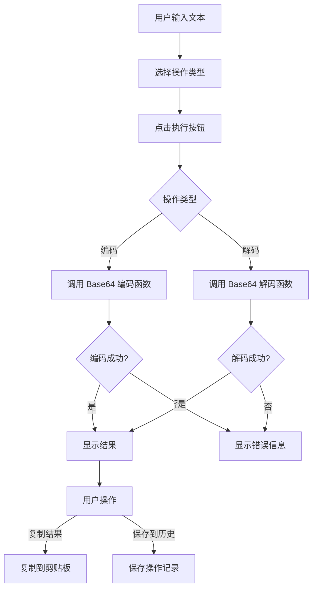
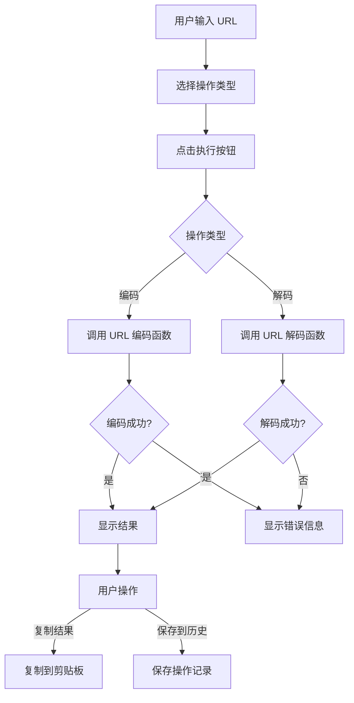
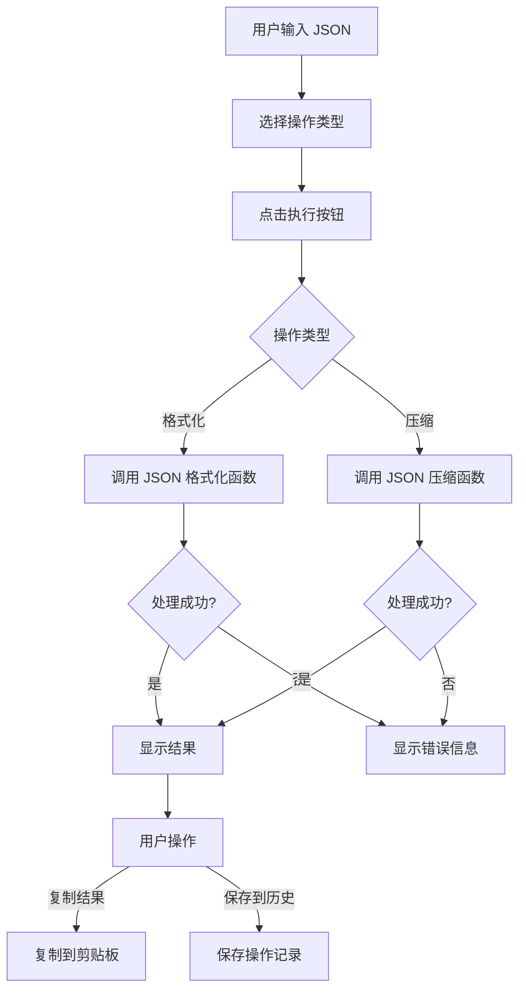

# 编码解码工具包技术方案

## 1. 技术方案概述

本技术方案基于编码解码工具包的需求文档，目标是实现 Base64 编码/解码、URL 编码/解码和 JSON 格式化/压缩功能。方案采用 React 组件化开发，结合 Electron 架构，确保功能完整且用户体验良好。

## 2. 技术栈与依赖

### 2.1 核心技术栈
- **React**: 前端 UI 库 → 所有 AC
- **TypeScript**: 类型安全的 JavaScript 超集 → 所有 AC
- **Tailwind CSS**: 实用优先的 CSS 框架 → 所有 AC
- **Electron**: 跨平台桌面应用框架 → 所有 AC

### 2.2 关键依赖
| 依赖名称 | 版本 | 用途 | 来源 |
|---------|------|------|------|
| react | ^18.2.0 | 前端 UI | package.json |
| typescript | ^5.3.3 | 类型系统 | package.json |
| tailwindcss | ^3.4.1 | 样式库 | package.json |
| zustand | ^4.5.0 | 状态管理 | package.json |

## 3. 项目结构设计

```
src/
├── renderer/
│   ├── components/        # 通用组件
│   ├── modules/           # 工具模块
│   │   └── encoder/       # 编码解码工具包
│   │       ├── components/ # 编码解码组件
│   │       │   ├── Base64Tool.tsx    # Base64 工具组件
│   │       │   ├── UrlTool.tsx       # URL 编码工具组件
│   │       │   └── JsonTool.tsx      # JSON 工具组件
│   │       ├── utils/      # 编码解码工具函数
│   │       │   ├── base64.ts         # Base64 编码/解码函数
│   │       │   ├── url.ts            # URL 编码/解码函数
│   │       │   └── json.ts           # JSON 处理函数
│   │       └── index.ts    # 编码解码模块入口
│   ├── store/             # 状态管理
│   │   └── encoderStore.ts # 编码解码工具状态
│   └── App.tsx            # 应用入口
└── types/                 # 类型定义
    └── encoder.ts         # 编码解码相关类型
```

## 4. 核心模块设计

### 4.1 编码解码工具组件

#### 4.1.1 Base64Tool 组件
- **实现文件**: `src/renderer/modules/encoder/components/Base64Tool.tsx`
- **核心功能**:
  - 提供 Base64 编码/解码界面 → AC-001, AC-002
  - 支持文本输入和结果显示 → AC-001, AC-002
  - 实现编码/解码操作切换 → AC-001, AC-002
  - 错误处理和提示 → AC-009, AC-012
  - 结果复制功能 → AC-007
  - 历史记录保存功能 → AC-008

#### 4.1.2 UrlTool 组件
- **实现文件**: `src/renderer/modules/encoder/components/UrlTool.tsx`
- **核心功能**:
  - 提供 URL 编码/解码界面 → AC-003, AC-004
  - 支持 URL 输入和结果显示 → AC-003, AC-004
  - 实现编码/解码操作切换 → AC-003, AC-004
  - 错误处理和提示 → AC-010, AC-012
  - 结果复制功能 → AC-007
  - 历史记录保存功能 → AC-008

#### 4.1.3 JsonTool 组件
- **实现文件**: `src/renderer/modules/encoder/components/JsonTool.tsx`
- **核心功能**:
  - 提供 JSON 格式化/压缩界面 → AC-005, AC-006
  - 支持 JSON 输入和结果显示 → AC-005, AC-006
  - 实现格式化/压缩操作切换 → AC-005, AC-006
  - 错误处理和提示 → AC-011, AC-012
  - 结果复制功能 → AC-007
  - 历史记录保存功能 → AC-008

### 4.2 编码解码工具函数

#### 4.2.1 Base64 工具函数
- **实现文件**: `src/renderer/modules/encoder/utils/base64.ts`
- **核心功能**:
  - Base64 编码函数 → AC-001, AC-014
  - Base64 解码函数 → AC-002
  - 无效输入检测 → AC-009

#### 4.2.2 URL 工具函数
- **实现文件**: `src/renderer/modules/encoder/utils/url.ts`
- **核心功能**:
  - URL 编码函数 → AC-003, AC-015
  - URL 解码函数 → AC-004
  - 无效输入检测 → AC-010

#### 4.2.3 JSON 工具函数
- **实现文件**: `src/renderer/modules/encoder/utils/json.ts`
- **核心功能**:
  - JSON 格式化函数 → AC-005, AC-016
  - JSON 压缩函数 → AC-006, AC-016
  - 无效输入检测 → AC-011

### 4.3 状态管理

#### 4.3.1 编码解码工具状态
- **实现文件**: `src/renderer/store/encoderStore.ts`
- **核心功能**:
  - 管理当前选中的工具 → AC-017
  - 保存各工具的状态 → AC-017
  - 处理工具切换逻辑 → AC-017

### 4.4 历史记录管理

#### 4.4.1 历史记录保存
- **实现方式**: 利用现有的数据库基础设施
- **核心功能**:
  - 保存编码解码操作记录 → AC-008
  - 记录工具类型、输入、输出和时间戳 → AC-008

## 5. 核心流程设计

### 5.1 Base64 编码/解码流程



### 5.2 URL 编码/解码流程



### 5.3 JSON 格式化/压缩流程



## 6. API 设计

### 6.1 工具函数 API

| 函数名称 | 功能描述 | 参数 | 返回值 | 对应 AC |
|---------|---------|------|--------|--------|
| `base64Encode` | Base64 编码 | `text: string` | `string` 编码结果 | AC-001, AC-014 |
| `base64Decode` | Base64 解码 | `text: string` | `string` 解码结果 | AC-002 |
| `urlEncode` | URL 编码 | `url: string` | `string` 编码结果 | AC-003, AC-015 |
| `urlDecode` | URL 解码 | `url: string` | `string` 解码结果 | AC-004 |
| `jsonFormat` | JSON 格式化 | `json: string` | `string` 格式化结果 | AC-005, AC-016 |
| `jsonCompress` | JSON 压缩 | `json: string` | `string` 压缩结果 | AC-006, AC-016 |

### 6.2 状态管理 API

| 方法名称 | 功能描述 | 参数 | 返回值 | 对应 AC |
|---------|---------|------|--------|--------|
| `setCurrentTool` | 设置当前工具 | `tool: 'base64' | 'url' | 'json'` | `void` | AC-017 |
| `setToolState` | 设置工具状态 | `tool: string, state: any` | `void` | AC-017 |
| `getToolState` | 获取工具状态 | `tool: string` | `any` 工具状态 | AC-017 |

### 6.3 历史记录 API

| 方法名称 | 功能描述 | 参数 | 返回值 | 对应 AC |
|---------|---------|------|--------|--------|
| `saveToHistory` | 保存到历史记录 | `toolType: string, input: string, output: string` | `Promise<boolean>` 保存成功状态 | AC-008 |

## 7. 错误处理与边界情况

### 7.1 输入验证
- **实现方式**: 在工具函数中进行输入验证
- **错误类型**:
  - 空输入 → AC-012
  - 无效的 Base64 编码 → AC-009
  - 无效的 URL 编码 → AC-010
  - 无效的 JSON 数据 → AC-011
- **处理策略**: 显示友好的错误提示，阻止执行操作

### 7.2 大文本处理
- **实现方式**: 使用高效的字符串处理方法
- **处理策略**:
  - 优化字符串处理算法
  - 使用防抖处理避免频繁执行
  - 确保大文本处理时无卡顿 → AC-013

### 7.3 复制功能错误处理
- **实现方式**: 捕获复制操作的异常
- **处理策略**:
  - 复制失败时显示错误提示
  - 提供手动复制的选项

## 8. 性能优化

### 8.1 渲染性能
- **优化策略**:
  - 使用 React.memo 优化组件渲染
  - 避免不必要的重渲染
  - 使用防抖处理输入变化

### 8.2 计算性能
- **优化策略**:
  - 使用高效的编码/解码算法
  - 避免重复计算
  - 对大文本处理进行性能优化 → AC-013

## 9. 实现计划

### 9.1 阶段一：工具函数实现
- 实现 Base64 编码/解码函数 → AC-001, AC-002, AC-009, AC-014
- 实现 URL 编码/解码函数 → AC-003, AC-004, AC-010, AC-015
- 实现 JSON 格式化/压缩函数 → AC-005, AC-006, AC-011, AC-016

### 9.2 阶段二：工具组件实现
- 实现 Base64Tool 组件 → AC-001, AC-002, AC-007, AC-008, AC-009, AC-012
- 实现 UrlTool 组件 → AC-003, AC-004, AC-007, AC-008, AC-010, AC-012
- 实现 JsonTool 组件 → AC-005, AC-006, AC-007, AC-008, AC-011, AC-012

### 9.3 阶段三：状态管理实现
- 实现编码解码工具状态管理 → AC-017
- 集成工具切换逻辑 → AC-017

### 9.4 阶段四：集成与测试
- 集成历史记录保存功能 → AC-008
- 测试各工具功能 → 所有 AC
- 测试错误处理机制 → AC-009, AC-010, AC-011, AC-012
- 测试大文本处理 → AC-013

## 10. 验收标准对应表

| 验收标准 | 技术实现 | 对应文件 |
|---------|---------|---------|
| AC-001: Base64 编码功能 | Base64 编码函数和组件 | src/renderer/modules/encoder/utils/base64.ts, src/renderer/modules/encoder/components/Base64Tool.tsx |
| AC-002: Base64 解码功能 | Base64 解码函数和组件 | src/renderer/modules/encoder/utils/base64.ts, src/renderer/modules/encoder/components/Base64Tool.tsx |
| AC-003: URL 编码功能 | URL 编码函数和组件 | src/renderer/modules/encoder/utils/url.ts, src/renderer/modules/encoder/components/UrlTool.tsx |
| AC-004: URL 解码功能 | URL 解码函数和组件 | src/renderer/modules/encoder/utils/url.ts, src/renderer/modules/encoder/components/UrlTool.tsx |
| AC-005: JSON 格式化功能 | JSON 格式化函数和组件 | src/renderer/modules/encoder/utils/json.ts, src/renderer/modules/encoder/components/JsonTool.tsx |
| AC-006: JSON 压缩功能 | JSON 压缩函数和组件 | src/renderer/modules/encoder/utils/json.ts, src/renderer/modules/encoder/components/JsonTool.tsx |
| AC-007: 结果复制功能 | 复制功能实现 | 各工具组件中实现 |
| AC-008: 历史记录保存功能 | 历史记录保存实现 | 各工具组件中实现 |
| AC-009: Base64 解码无效输入 | 输入验证和错误处理 | src/renderer/modules/encoder/utils/base64.ts |
| AC-010: URL 解码无效输入 | 输入验证和错误处理 | src/renderer/modules/encoder/utils/url.ts |
| AC-011: JSON 格式化无效输入 | 输入验证和错误处理 | src/renderer/modules/encoder/utils/json.ts |
| AC-012: 空输入处理 | 输入验证和错误处理 | 各工具组件中实现 |
| AC-013: 大文本处理 | 性能优化实现 | 各工具函数中实现 |
| AC-014: Base64 编码标准 | Base64 编码函数实现 | src/renderer/modules/encoder/utils/base64.ts |
| AC-015: URL 编码标准 | URL 编码函数实现 | src/renderer/modules/encoder/utils/url.ts |
| AC-016: JSON 处理标准 | JSON 处理函数实现 | src/renderer/modules/encoder/utils/json.ts |
| AC-017: 工具切换 | 状态管理实现 | src/renderer/store/encoderStore.ts |

## 11. 风险评估

| 风险 | 影响 | 缓解措施 |
|-----|------|---------|
| 大文本处理性能问题 | 处理大文本时可能卡顿 | 实现防抖处理，优化算法 |
| 无效输入处理 | 可能导致应用崩溃 | 严格的输入验证和错误处理 |
| 历史记录保存失败 | 操作记录丢失 | 错误处理和重试机制 |
| 工具切换状态丢失 | 用户体验不佳 | 完善的状态管理实现 |

## 12. 结论

本技术方案详细描述了编码解码工具包的技术实现，覆盖了所有验收标准，确保功能完整且用户体验良好。方案采用了组件化设计，将工具函数与 UI 组件分离，提高了代码的可维护性和可测试性。

通过本方案的实施，编码解码工具包将具备以下能力：
- Base64 编码/解码功能
- URL 编码/解码功能
- JSON 格式化/压缩功能
- 结果复制功能
- 历史记录保存功能
- 良好的错误处理机制
- 高效的大文本处理能力

这些功能将为开发者提供便捷的编码解码工具，帮助他们在开发过程中快速处理各种编码解码需求，提高开发效率。