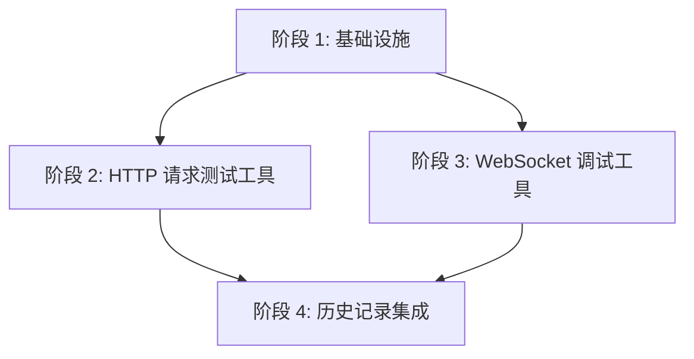

# 网络工具包 (Network) 任务规划

## 1. 任务规划概览

本任务规划基于网络工具包的技术方案，采用垂直切片策略，将功能按用户行为划分为多个可独立验证的切片。每个切片包含完整的技术栈实现，确保开发过程中能快速获得可演示的功能增量。

### 1.1 阶段划分

| 阶段 | 名称 | 描述 | 任务数 | 预估工时 |
|------|------|------|--------|----------|
| 阶段 1 | 基础设施 | 网络工具包的基础架构和状态管理 | 3 | 1.5 小时 |
| 阶段 2 | HTTP 请求测试工具 | 完整的 HTTP 请求发送和响应处理功能 | 4 | 4 小时 |
| 阶段 3 | WebSocket 调试工具 | 完整的 WebSocket 连接和消息处理功能 | 4 | 4 小时 |
| 阶段 4 | 历史记录集成 | HTTP 请求历史的存储和管理 | 3 | 2.5 小时 |

### 1.2 依赖关系

## 2. 详细任务规划

### 阶段 1: 基础设施

本阶段构建网络工具包的基础架构，包括状态管理和模块结构，为后续功能开发做准备。

#### 任务 1.1: 创建网络工具状态管理
- **技术方案章节**: 2.1.2 状态管理
- **AC 覆盖**: 全局状态管理支持
- **任务描述**: 创建 networkStore.ts，实现 HTTP 工具和 WebSocket 工具的状态管理
- **验证标准**: 
  - 状态管理能正确存储和更新 HTTP 工具的 URL、方法、请求头、请求体等状态
  - 状态管理能正确存储和更新 WebSocket 工具的 URL、状态、消息等状态
  - 状态更新能触发组件重新渲染
- **通俗解释**: 完成后，网络工具的状态将被统一管理，操作界面时状态会正确更新

#### 任务 1.2: 创建网络工具模块目录结构
- **技术方案章节**: 2.1.1 组件结构、2.2.1 组件结构
- **AC 覆盖**: 模块结构准备
- **任务描述**: 创建 network 模块目录结构，包括 components、utils 子目录
- **验证标准**: 
  - 目录结构符合项目规范
  - 目录结构包含所有必要的子目录
- **通俗解释**: 完成后，网络工具的代码将按照清晰的目录结构组织

#### 任务 1.3: 创建网络工具模块入口
- **技术方案章节**: 5.1 网络工具模块入口
- **AC 覆盖**: 模块集成准备
- **任务描述**: 创建 network/index.ts，导出 HTTP 工具和 WebSocket 工具组件
- **验证标准**: 
  - 模块入口能正确导出组件
  - 其他模块能通过统一入口导入网络工具组件
- **通俗解释**: 完成后，主应用可以通过统一的入口导入和使用网络工具

### 阶段 2: HTTP 请求测试工具

本阶段实现完整的 HTTP 请求测试功能，包括请求发送、响应处理和结果展示。

#### 任务 2.1: 实现 HTTP 请求核心逻辑
- **技术方案章节**: 2.1.3 核心逻辑
- **AC 覆盖**: AC-001, AC-002, AC-003, AC-004, AC-008, AC-010, AC-011, AC-012
- **任务描述**: 创建 utils/http.ts，实现 sendHttpRequest 函数，支持各种 HTTP 方法和请求体格式
- **验证标准**: 
  - 能正确发送 GET 请求并返回响应
  - 能正确发送 POST 请求，支持 JSON、表单数据、纯文本格式
  - 能正确处理网络错误和服务器错误
  - 能正确验证 JSON 格式
- **通俗解释**: 完成后，系统能发送各种类型的 HTTP 请求并处理响应

#### 任务 2.2: 实现 HTTP 工具 UI 组件
- **技术方案章节**: 2.1.4 组件实现
- **AC 覆盖**: AC-001, AC-002, AC-003, AC-004, AC-005, AC-006, AC-007, AC-009, AC-013
- **任务描述**: 创建 components/HttpTool.tsx，实现 HTTP 请求测试的用户界面
- **验证标准**: 
  - 界面能输入 URL、选择 HTTP 方法
  - 界面能添加、删除和编辑请求头
  - 界面能输入和选择请求体格式
  - 界面能显示响应结果（状态码、响应头、响应体、响应时间）
  - 界面能复制结果和保存到历史记录
- **通俗解释**: 完成后，用户可以通过界面发送 HTTP 请求并查看响应结果

#### 任务 2.3: 集成 HTTP 工具到主应用
- **技术方案章节**: 5.2 主应用集成
- **AC 覆盖**: 工具集成
- **任务描述**: 修改 App.tsx，添加 HTTP 工具的导航和组件集成
- **验证标准**: 
  - 主应用侧边栏显示 HTTP 请求工具导航
  - 点击导航能正确显示 HTTP 工具界面
  - 工具界面能正常工作
- **通俗解释**: 完成后，用户可以在主应用中访问和使用 HTTP 请求工具

#### 任务 2.4: 测试 HTTP 工具功能
- **技术方案章节**: 7.1 单元测试, 7.2 集成测试, 7.3 端到端测试
- **AC 覆盖**: 所有 HTTP 相关 AC
- **任务描述**: 编写和运行测试，验证 HTTP 工具的功能正确性
- **验证标准**: 
  - 单元测试覆盖核心逻辑
  - 集成测试覆盖组件功能
  - 端到端测试覆盖完整流程
  - 所有测试通过
- **通俗解释**: 完成后，HTTP 工具的功能将得到全面验证

### 阶段 3: WebSocket 调试工具

本阶段实现完整的 WebSocket 调试功能，包括连接管理、消息发送和接收。

#### 任务 3.1: 实现 WebSocket 客户端核心逻辑
- **技术方案章节**: 2.2.2 核心逻辑
- **AC 覆盖**: AC-014, AC-017, AC-018, AC-020, AC-025, AC-026
- **任务描述**: 创建 utils/websocket.ts，实现 WebSocketClient 类，支持连接管理、自动重连和心跳
- **验证标准**: 
  - 能正确建立 WebSocket 连接
  - 能自动重连断开的连接
  - 能定期发送心跳消息
  - 能处理连接错误
- **通俗解释**: 完成后，系统能稳定管理 WebSocket 连接

#### 任务 3.2: 实现 WebSocket 工具 UI 组件
- **技术方案章节**: 2.2.3 组件实现
- **AC 覆盖**: AC-014, AC-015, AC-016, AC-019, AC-021, AC-022, AC-023, AC-024
- **任务描述**: 创建 components/WebSocketTool.tsx，实现 WebSocket 调试的用户界面
- **验证标准**: 
  - 界面能输入 WebSocket URL 并连接
  - 界面能显示连接状态（连接中/已连接/断开）
  - 界面能发送消息（纯文本和 JSON 格式）
  - 界面能以时间线方式显示发送和接收的消息
  - 界面能清空消息
- **通俗解释**: 完成后，用户可以通过界面连接 WebSocket 服务器并发送/接收消息

#### 任务 3.3: 集成 WebSocket 工具到主应用
- **技术方案章节**: 5.2 主应用集成
- **AC 覆盖**: 工具集成
- **任务描述**: 修改 App.tsx，添加 WebSocket 工具的导航和组件集成
- **验证标准**: 
  - 主应用侧边栏显示 WebSocket 调试工具导航
  - 点击导航能正确显示 WebSocket 工具界面
  - 工具界面能正常工作
- **通俗解释**: 完成后，用户可以在主应用中访问和使用 WebSocket 调试工具

#### 任务 3.4: 测试 WebSocket 工具功能
- **技术方案章节**: 7.1 单元测试, 7.2 集成测试, 7.3 端到端测试
- **AC 覆盖**: 所有 WebSocket 相关 AC
- **任务描述**: 编写和运行测试，验证 WebSocket 工具的功能正确性
- **验证标准**: 
  - 单元测试覆盖 WebSocket 客户端核心逻辑
  - 集成测试覆盖组件功能
  - 端到端测试覆盖完整流程
  - 所有测试通过
- **通俗解释**: 完成后，WebSocket 工具的功能将得到全面验证

### 阶段 4: 历史记录集成

本阶段实现 HTTP 请求历史的存储和管理功能。

#### 任务 4.1: 创建 HTTP 历史数据库表结构
- **技术方案章节**: 3.1 HTTP 请求历史存储
- **AC 覆盖**: 历史记录存储
- **任务描述**: 修改 database/schema.ts，添加 HTTP 历史表结构
- **验证标准**: 
  - 数据库表结构符合设计
  - 表结构包含所有必要字段
  - 表结构能正确创建
- **通俗解释**: 完成后，系统将有专门的表存储 HTTP 请求历史

#### 任务 4.2: 实现 HTTP 历史数据操作
- **技术方案章节**: 3.2 数据操作
- **AC 覆盖**: 历史记录管理
- **任务描述**: 创建 database/history.ts，实现 HistoryRepository 类，支持 HTTP 历史的增删改查
- **验证标准**: 
  - 能正确保存 HTTP 请求历史
  - 能正确获取 HTTP 请求历史
  - 能正确删除 HTTP 请求历史
  - 能正确清空 HTTP 请求历史
- **通俗解释**: 完成后，系统能管理 HTTP 请求历史数据

#### 任务 4.3: 实现网络相关 IPC 通信
- **技术方案章节**: 4.1 主进程 IPC 处理, 4.2 预加载脚本
- **AC 覆盖**: 历史记录集成
- **任务描述**: 创建 ipc/ipc-network.ts，实现网络相关的 IPC 处理；修改 preload/index.ts，暴露网络相关的 API
- **验证标准**: 
  - 渲染进程能通过 IPC 保存 HTTP 请求历史
  - 渲染进程能通过 IPC 获取 HTTP 请求历史
  - 渲染进程能通过 IPC 删除 HTTP 请求历史
  - 渲染进程能通过 IPC 清空 HTTP 请求历史
- **通俗解释**: 完成后，网络工具能与主进程通信，实现历史记录的存储和管理

## 3. 验证计划

### 3.1 阶段验证

| 阶段 | 完成标准 | 验证方法 | 关联任务 | 关联 AC |
|------|----------|----------|----------|----------|
| 阶段 1 | 网络工具状态管理和模块结构搭建完成 | 检查代码结构和状态管理功能 | 1.1, 1.2, 1.3 | 全局支持 |
| 阶段 2 | HTTP 请求测试工具功能完整可用 | 手动测试 HTTP 请求功能 | 2.1, 2.2, 2.3, 2.4 | AC-001 至 AC-013 |
| 阶段 3 | WebSocket 调试工具功能完整可用 | 手动测试 WebSocket 功能 | 3.1, 3.2, 3.3, 3.4 | AC-014 至 AC-026 |
| 阶段 4 | HTTP 请求历史功能完整可用 | 手动测试历史记录功能 | 4.1, 4.2, 4.3 | 历史记录管理 |

### 3.2 关键功能验证

| 功能 | 验证方法 | 关联任务 | 关联 AC |
|------|----------|----------|----------|
| HTTP 请求发送 | 发送 GET、POST、PUT、DELETE、PATCH、HEAD、OPTIONS 请求，验证响应结果 | 2.1, 2.2 | AC-001, AC-002, AC-003 |
| 请求体格式 | 测试 JSON、表单数据、纯文本格式的请求体 | 2.1, 2.2 | AC-004 |
| 响应结果展示 | 验证状态码、响应头、响应体、响应时间的显示 | 2.2 | AC-013 |
| WebSocket 连接 | 测试 WebSocket 连接的建立、断开和重连 | 3.1, 3.2 | AC-014, AC-017 |
| WebSocket 消息 | 测试消息的发送和接收，验证时间线展示 | 3.1, 3.2 | AC-015, AC-016 |
| 历史记录 | 测试 HTTP 请求历史的保存、获取、删除和清空 | 4.1, 4.2, 4.3 | 历史记录管理 |

## 4. 风险与应对策略

| 风险 | 应对策略 | 关联任务 |
|------|----------|----------|
| 网络请求超时 | 在 axios 配置中设置合理的超时时间，提供用户友好的错误提示 | 2.1 |
| WebSocket 连接不稳定 | 实现自动重连机制，增加心跳检测 | 3.1 |
| 大量历史记录导致性能问题 | 限制历史记录数量，实现分页加载 | 4.2 |
| 跨域请求限制 | 利用 Electron 的网络能力，避免浏览器的跨域限制 | 2.1 |
| 内存泄漏 | 确保 WebSocket 连接在组件卸载时正确关闭 | 3.2 |

## 5. 总结

本任务规划采用垂直切片策略，将网络工具包的开发划分为四个阶段，每个阶段都能独立验证和演示。通过清晰的任务划分和验证标准，确保开发过程能按照 TDD 流程进行，提高代码质量和开发效率。

任务规划覆盖了所有需求文档中的验收标准，为后续的开发和测试提供了明确的指导。开发团队可以按照任务顺序逐步实现功能，每个阶段完成后都能获得可演示的功能增量，从而快速获得反馈并调整开发方向。